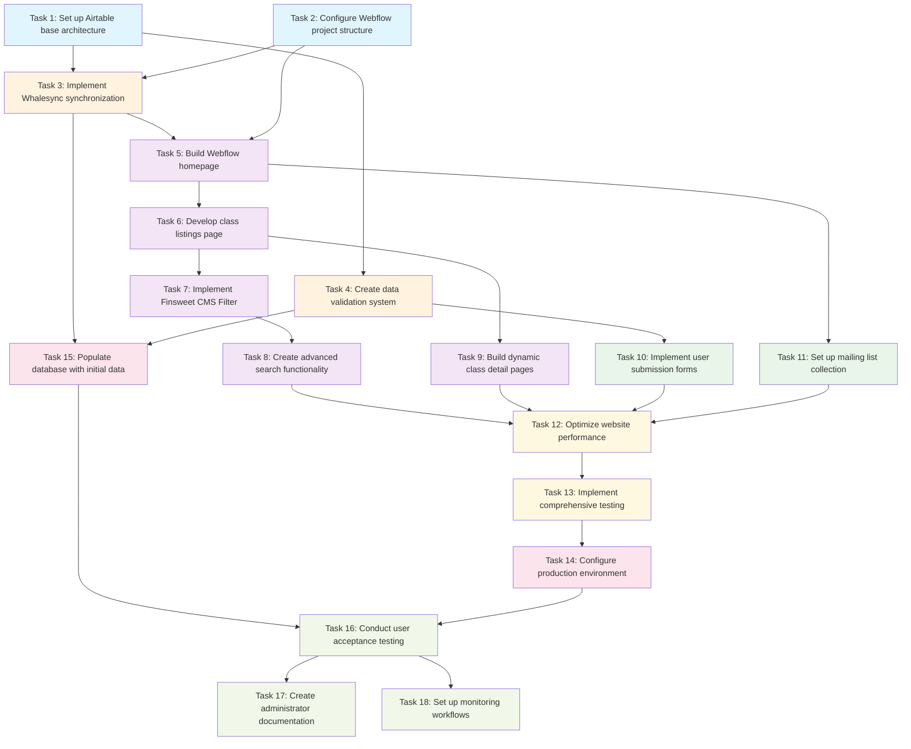

# Implementation Plan - Hobby Classes Directory

Convert the feature design into a series of prompts for a code-generation LLM that will implement each step in a test-driven manner. Prioritize best practices, incremental progress, and early testing, ensuring no big jumps in complexity at any stage. Make sure that each prompt builds on the previous prompts, and ends with wiring things together. There should be no hanging or orphaned code that isn't integrated into a previous step. Focus ONLY on tasks that involve writing, modifying, or testing code.

## Phase 1: Foundation and Architecture Setup

- [ ] 1. Set up Airtable base architecture with core data structures
  - Create Airtable base with optimized table structure (Classes, Instructors, Categories, Locations)
  - Implement field validation rules and data constraints as specified in design
  - Set up lookup fields and relationship mappings between tables
  - Configure proper field types (Single line text, Long text, Links, Attachments, etc.)
  - Create sample data entries for testing synchronization functionality
  - _Requirements: 2.1, 2.2, 2.3, 2.4, 5.1_

- [ ] 2. Configure Webflow project structure with CMS collections
  - Create new Webflow project with responsive design framework
  - Set up CMS collections matching Airtable schema (Classes, Instructors, Categories, Locations)
  - Configure collection fields with proper data types and validation
  - Create collection templates for dynamic content rendering
  - Implement basic responsive grid layout for class listings
  - _Requirements: 1.1, 1.5, 8.1, 8.4, 8.5_

## Phase 2: Data Synchronization Implementation

- [ ] 3. Implement Whalesync bidirectional data synchronization
  - Set up Whalesync account and connect Airtable and Webflow integrations
  - Configure field mapping between Airtable tables and Webflow collections
  - Implement sync rules for data validation and conflict resolution
  - Test basic synchronization with sample data entries
  - Set up sync monitoring and error notification systems
  - _Requirements: 2.2, 2.3, 2.4, 7.4_

- [ ] 4. Create data validation and quality control system
  - Implement Airtable automation rules for data validation
  - Create data integrity checks for required fields and relationships
  - Set up duplicate detection algorithms using fuzzy matching
  - Configure automated data quality reports and admin notifications
  - Test validation rules with edge cases and invalid data entries
  - _Requirements: 5.1, 5.2, 5.4, 5.5_

## Phase 3: Frontend Development and User Interface

- [ ] 5. Build Webflow homepage with search functionality
  - Design responsive homepage layout using Relume components
  - Implement hero section with primary search interface
  - Create featured classes section with dynamic content from CMS
  - Add navigation menu with links to main sections
  - Implement basic search input with placeholder functionality
  - _Requirements: 1.1, 8.1, 8.2, 8.4_

- [ ] 6. Develop class listings page with collection display
  - Create collection list page for displaying all classes
  - Implement responsive card layout for class preview information
  - Add pagination system for handling large datasets (100 items per page)
  - Create class detail page template with comprehensive information display
  - Implement dynamic routing and SEO-friendly URLs for class pages
  - _Requirements: 1.2, 1.5, 4.1, 4.2, 4.3, 7.1_

- [ ] 7. Implement Finsweet CMS Filter for advanced search and filtering
  - Install and configure Finsweet CMS Filter v2 components
  - Set up category-based filtering with dynamic filter options
  - Implement location-based filtering with neighborhood selection
  - Create price range filtering for different pricing tiers
  - Add tag-based filtering for skill levels and class types
  - Configure filter state management and URL parameter handling
  - _Requirements: 3.1, 3.2, 3.3, 3.4, 3.5, 3.6, 3.7_

## Phase 4: Enhanced Search and User Experience

- [ ] 8. Create advanced search functionality with fuzzy matching
  - Implement text-based search across class titles and descriptions
  - Add instructor name search with auto-complete suggestions
  - Create search result highlighting and relevance scoring
  - Implement search history and suggested searches
  - Add "no results found" page with alternative search suggestions
  - _Requirements: 3.1, 3.5, 3.6, 7.1, 7.2_

- [ ] 9. Build dynamic class detail pages with comprehensive information
  - Create detailed class information layout with instructor profiles
  - Implement image gallery functionality for class photos
  - Add scheduling information display with calendar integration
  - Include contact information and inquiry forms
  - Add social sharing capabilities and bookmarking functionality
  - _Requirements: 4.1, 4.2, 4.3, 4.4, 4.5_

## Phase 5: Content Management and User Interaction

- [ ] 10. Implement user submission forms for class suggestions
  - Create Webflow forms for class suggestions and provider inquiries
  - Set up form validation and required field handling
  - Configure form submissions to populate Airtable submissions table
  - Implement automated email confirmations for form submissions
  - Create admin review workflow for processing submissions
  - _Requirements: 5.2, 5.3, 6.3_

- [ ] 11. Set up mailing list collection and preference management
  - Create mailing list signup forms with preference selection
  - Implement category-based interest selection system
  - Set up automated welcome email sequences
  - Create preference management and unsubscribe functionality
  - Configure GDPR-compliant data collection and consent handling
  - _Requirements: 6.1, 6.2, 6.4, 6.5_

## Phase 6: Performance Optimization and Testing

- [ ] 12. Optimize website performance for large datasets
  - Implement lazy loading for images and collection items
  - Configure CDN settings and image optimization
  - Set up database indexing strategies for faster queries
  - Optimize collection list loading with progressive enhancement
  - Implement caching strategies for frequently accessed data
  - _Requirements: 7.1, 7.2, 7.3, 7.4_

- [ ] 13. Implement comprehensive testing suite for all functionality
  - Create automated tests for data synchronization between platforms
  - Test search and filter functionality with various data combinations
  - Perform cross-browser compatibility testing (Chrome, Firefox, Safari, Edge)
  - Conduct mobile responsiveness testing across different device sizes
  - Validate form submission workflows and error handling
  - _Requirements: 8.1, 8.3, 8.4, 8.5_

## Phase 7: Launch Preparation and Quality Assurance

- [ ] 14. Configure production environment and domain setup
  - Set up custom domain with DNS configuration
  - Implement SSL certificates and security headers
  - Configure analytics tracking (Google Analytics, Webflow Analytics)
  - Set up monitoring and uptime alerts
  - Create backup procedures for Airtable data
  - _Requirements: 7.3, 9.2, 9.4_

- [ ] 15. Populate database with initial class data and content
  - Research and compile comprehensive list of Vancouver hobby classes
  - Create instructor profiles with photos and biographical information
  - Organize classes into appropriate categories and locations
  - Validate all data entries for accuracy and completeness
  - Test synchronization with full production dataset
  - _Requirements: 5.1, 5.3, 9.1_

- [ ] 16. Conduct user acceptance testing and final optimization
  - Perform comprehensive functional testing of all features
  - Test website performance under simulated load conditions
  - Validate SEO implementation and search engine visibility
  - Conduct accessibility audit and WCAG compliance verification
  - Perform final content review and quality assurance check
  - _Requirements: 7.1, 7.2, 7.3, 8.1, 8.4, 8.5_

## Phase 8: Documentation and Handover

- [ ] 17. Create comprehensive administrator documentation
  - Write step-by-step guide for managing class data in Airtable
  - Document Whalesync synchronization monitoring and troubleshooting
  - Create user manual for content updates and maintenance procedures
  - Establish data backup and recovery procedures
  - Document troubleshooting guide for common issues
  - _Requirements: 9.1, 9.3, 9.4_

- [ ] 18. Set up monitoring and maintenance workflows
  - Configure automated health checks for synchronization processes
  - Set up performance monitoring and alerting systems
  - Create maintenance schedules for data quality reviews
  - Implement user feedback collection and analysis system
  - Establish procedures for handling user inquiries and technical support
  - _Requirements: 7.3, 7.4, 9.2, 9.4, 9.5_

## Tasks Dependency Diagram

**Legend:**
- **Blue (Foundation)**: Core architecture setup
- **Orange (Integration)**: Data synchronization and validation
- **Purple (Frontend)**: User interface development
- **Green (Content)**: User interaction and content management
- **Yellow (Performance)**: Optimization and testing
- **Pink (Launch)**: Production setup and deployment
- **Light Green (Documentation)**: Final documentation and handover