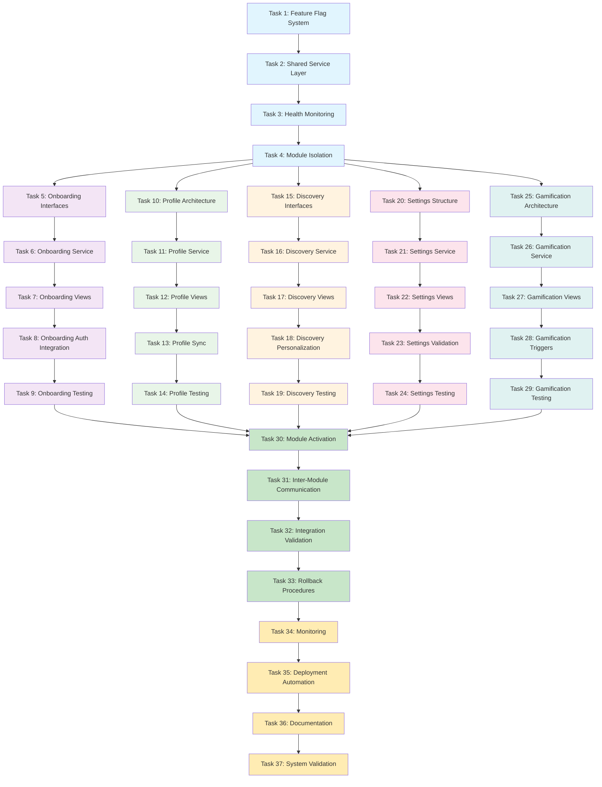

# Incremental Service Integration Implementation Plan

## Overview
This implementation plan follows the MODULAR FEATURE RESTORATION approach to incrementally integrate services while building on the existing SimpleSupabaseService pattern. The focus is on feature-driven development where each module can be developed, tested, and deployed independently while avoiding problematic services completely.

---

## Phase 1: Foundation & Core Infrastructure

- [ ] 1. Create feature flag system for safe rollout
  - Implement FeatureFlagManager with local configuration support
  - Add feature flag checks for each module (onboarding, profile, discovery, settings, gamification)
  - Create debug interface to toggle features during development
  - _Requirements: Safe rollout mechanism, independent module control_

- [ ] 2. Establish shared service layer architecture
  - Create ModularServiceProtocol interface defining common service patterns
  - Implement ServiceModuleRegistry for dynamic service discovery and registration
  - Create BaseModuleService extending SimpleSupabaseService pattern
  - Add error handling and logging infrastructure for modular services
  - _Requirements: Consistent service interface, modular architecture_

- [ ] 3. Implement service health monitoring
  - Create ServiceHealthMonitor to track module availability and performance
  - Add circuit breaker pattern for failing services
  - Implement fallback mechanisms for unavailable modules
  - Create service dependency mapping and validation
  - _Requirements: System resilience, independent module operation_

- [ ] 4. Create module isolation boundaries
  - Implement ModuleContainer for isolated dependency injection
  - Create inter-module communication protocols using event bus pattern
  - Add module lifecycle management (initialize, start, stop, cleanup)
  - Implement data isolation layers between modules
  - _Requirements: Module independence, clean separation of concerns_

---

## Phase 2: Onboarding Module

- [ ] 5. Design onboarding module interfaces
  - Create OnboardingModuleProtocol defining all onboarding operations
  - Design OnboardingState model with progress tracking
  - Define OnboardingStep enumeration with completion validation
  - Create OnboardingDataService interface for user preference storage
  - _Requirements: Independent onboarding flow, progress persistence_

- [ ] 6. Implement core onboarding service
  - Create OnboardingService extending BaseModuleService
  - Implement step navigation logic with validation
  - Add user preference collection and storage
  - Create onboarding completion tracking and metrics
  - _Requirements: Step-by-step user guidance, preference collection_

- [ ] 7. Build onboarding view components
  - Create OnboardingCoordinator for flow management
  - Implement WelcomeView, PreferencesView, and CompletionView
  - Add progress indicators and step validation UI
  - Create smooth transitions between onboarding steps
  - _Requirements: Intuitive user experience, visual progress tracking_

- [ ] 8. Integrate onboarding with authentication
  - Connect onboarding flow to SimpleSupabaseService authentication
  - Implement post-signup onboarding trigger
  - Add onboarding skip/resume functionality
  - Create onboarding completion status in user profile
  - _Requirements: Seamless auth integration, flexible completion_

- [ ] 9. Test onboarding module independently
  - Create OnboardingModuleTests with full coverage
  - Implement mock services for isolated testing
  - Add integration tests with SimpleSupabaseService
  - Test onboarding flow with feature flags disabled
  - _Requirements: Module reliability, independent operation_

---

## Phase 3: Profile Module

- [ ] 10. Design profile module architecture
  - Create ProfileModuleProtocol with user data management operations
  - Design ProfileState model with real-time synchronization
  - Define ProfileDataService interface for CRUD operations
  - Create ProfileImageService for avatar management
  - _Requirements: User data management, real-time updates_

- [ ] 11. Implement profile data service
  - Create ProfileService extending BaseModuleService
  - Implement user profile CRUD operations using SimpleSupabaseService pattern
  - Add profile image upload and management
  - Create profile validation and data sanitization
  - _Requirements: Secure data handling, image management_

- [ ] 12. Build profile view components
  - Create ProfileViewController for profile management
  - Implement ProfileEditView with form validation
  - Add ProfileImagePicker with crop functionality
  - Create profile settings and privacy controls
  - _Requirements: User-friendly profile management, privacy controls_

- [ ] 13. Implement profile synchronization
  - Add real-time profile updates using Supabase subscriptions
  - Implement offline profile editing with sync on reconnection
  - Create conflict resolution for concurrent profile updates
  - Add profile change history and audit trail
  - _Requirements: Real-time sync, offline capability_

- [ ] 14. Test profile module integration
  - Create ProfileModuleTests with comprehensive scenarios
  - Test profile sync with multiple devices/sessions
  - Validate profile data integrity and validation rules
  - Test profile module with other modules disabled
  - _Requirements: Data consistency, module independence_

---

## Phase 4: Discovery Module

- [ ] 15. Design discovery module interfaces
  - Create DiscoveryModuleProtocol for class search and filtering
  - Design DiscoveryFilters model with preferences persistence
  - Define SearchService interface for query optimization
  - Create RecommendationService interface for personalized suggestions
  - _Requirements: Flexible search, personalized discovery_

- [ ] 16. Implement discovery data service
  - Create DiscoveryService extending BaseModuleService
  - Implement class search with filters and sorting
  - Add location-based discovery with privacy controls
  - Create recommendation algorithm based on user preferences
  - _Requirements: Efficient search, location awareness, recommendations_

- [ ] 17. Build discovery view components
  - Create DiscoveryViewController for search interface
  - Implement SearchResultsView with filtering controls
  - Add MapView for location-based discovery
  - Create ClassCardView for discovery results display
  - _Requirements: Intuitive search interface, visual results_

- [ ] 18. Implement discovery personalization
  - Add user preference learning from search behavior
  - Implement saved searches and alerts
  - Create discovery history and recent searches
  - Add social discovery features (following preferences)
  - _Requirements: Personalized experience, search history_

- [ ] 19. Test discovery module functionality
  - Create DiscoveryModuleTests with search scenarios
  - Test discovery with location permissions enabled/disabled
  - Validate search performance with large datasets
  - Test discovery module isolation from other features
  - _Requirements: Search accuracy, performance, independence_

---

## Phase 5: Settings Module

- [ ] 20. Design settings module structure
  - Create SettingsModuleProtocol for configuration management
  - Design SettingsModel with grouped preferences
  - Define NotificationSettings, PrivacySettings, and AppSettings models
  - Create SettingsDataService interface for persistence
  - _Requirements: Organized settings, preference persistence_

- [ ] 21. Implement settings data service
  - Create SettingsService extending BaseModuleService
  - Implement settings CRUD operations with validation
  - Add settings synchronization across devices
  - Create settings export/import functionality
  - _Requirements: Settings persistence, cross-device sync_

- [ ] 22. Build settings view components
  - Create SettingsViewController with grouped sections
  - Implement SettingsRowView for different input types
  - Add ToggleSettingsView, SliderSettingsView, and PickerSettingsView
  - Create settings search and quick access functionality
  - _Requirements: User-friendly settings interface, search capability_

- [ ] 23. Implement settings validation and constraints
  - Add settings value validation and constraints
  - Implement dependent settings logic (e.g., location requires permissions)
  - Create settings reset and restore defaults functionality
  - Add settings change confirmation for destructive actions
  - _Requirements: Data integrity, user safety, dependency management_

- [ ] 24. Test settings module compliance
  - Create SettingsModuleTests with validation scenarios
  - Test settings persistence across app launches
  - Validate settings constraints and dependencies
  - Test settings module with minimal dependencies
  - _Requirements: Settings reliability, constraint validation_

---

## Phase 6: Gamification Module

- [ ] 25. Design gamification module architecture
  - Create GamificationModuleProtocol for achievements and rewards
  - Design AchievementEngine model with progress tracking
  - Define BadgeSystem, PointsSystem, and LevelSystem interfaces
  - Create GamificationDataService for progress persistence
  - _Requirements: Achievement tracking, reward system_

- [ ] 26. Implement gamification core service
  - Create GamificationService extending BaseModuleService
  - Implement achievement detection and progress tracking
  - Add points calculation and level progression logic
  - Create badge unlocking and notification system
  - _Requirements: Achievement logic, progress calculation_

- [ ] 27. Build gamification view components
  - Create AchievementsViewController for progress display
  - Implement BadgeCollectionView with unlock animations
  - Add ProgressView for level advancement visualization
  - Create LeaderboardView for social competition (optional)
  - _Requirements: Engaging achievement display, progress visualization_

- [ ] 28. Implement gamification triggers
  - Add event listeners for class attendance, bookings, and completions
  - Implement milestone detection and celebration
  - Create achievement notification system
  - Add gamification data analytics and insights
  - _Requirements: Automatic achievement detection, user engagement_

- [ ] 29. Test gamification module isolation
  - Create GamificationModuleTests with achievement scenarios
  - Test gamification with varying user activity levels
  - Validate achievement logic and points calculation
  - Test gamification module as optional feature
  - _Requirements: Achievement accuracy, optional functionality_

---

## Phase 7: Progressive Integration

- [ ] 30. Implement gradual module activation
  - Create ModuleActivationService for controlled rollout
  - Add module dependency resolution and loading order
  - Implement graceful degradation when modules are disabled
  - Create module activation analytics and monitoring
  - _Requirements: Controlled activation, dependency management_

- [ ] 31. Build inter-module communication
  - Implement EventBus for loose coupling between modules
  - Create shared data contracts for cross-module operations
  - Add module state synchronization mechanisms
  - Implement module-to-module service discovery
  - _Requirements: Module communication, loose coupling_

- [ ] 32. Create integration validation suite
  - Implement IntegrationTestSuite for module interactions
  - Add performance testing for modular architecture
  - Create module compatibility validation
  - Test complete user flows across multiple modules
  - _Requirements: Integration reliability, performance validation_

- [ ] 33. Implement rollback and disable procedures
  - Create ModuleRollbackService for emergency disabling
  - Add data migration tools for module removal
  - Implement feature flag automation for quick rollbacks
  - Create rollback validation and verification procedures
  - _Requirements: Emergency rollback capability, data safety_

---

## Phase 8: Production Readiness

- [ ] 34. Implement comprehensive monitoring
  - Create ModuleMetricsCollector for performance tracking
  - Add error reporting specific to each module
  - Implement user experience analytics per module
  - Create operational dashboards for module health
  - _Requirements: Production monitoring, module-specific metrics_

- [ ] 35. Create deployment automation
  - Implement automated testing pipeline for modular changes
  - Add module-specific deployment validation
  - Create rollback automation based on health metrics
  - Implement gradual rollout automation with feature flags
  - _Requirements: Automated deployment, validation pipeline_

- [ ] 36. Document modular architecture
  - Create architectural decision records for modular approach
  - Document module interfaces and dependencies
  - Add troubleshooting guides for module issues
  - Create developer onboarding guide for modular development
  - _Requirements: Architecture documentation, developer guidance_

- [ ] 37. Validate complete system integration
  - Run full end-to-end testing with all modules enabled
  - Perform load testing on modular architecture
  - Validate user experience across all module combinations
  - Create production readiness checklist and sign-off
  - _Requirements: System validation, production readiness_

---

## Tasks Dependency Diagram

