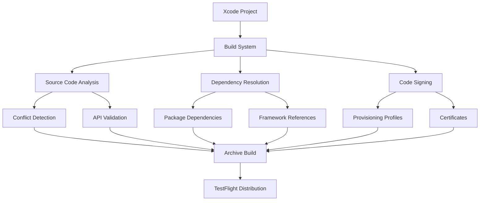
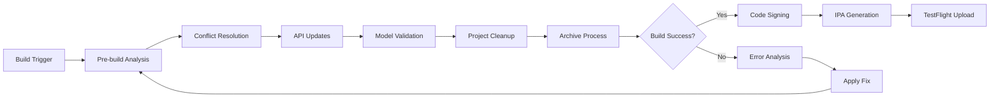
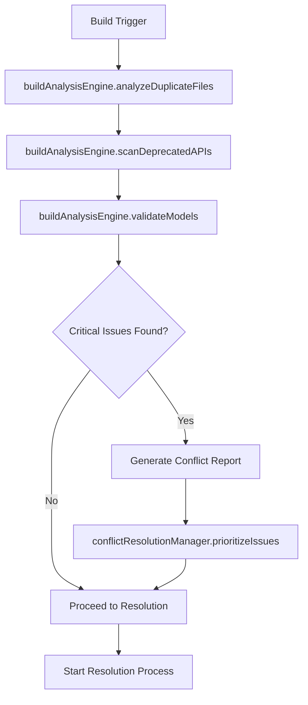
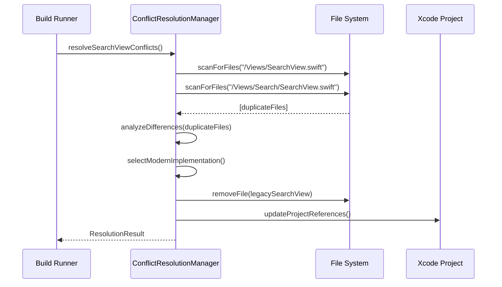
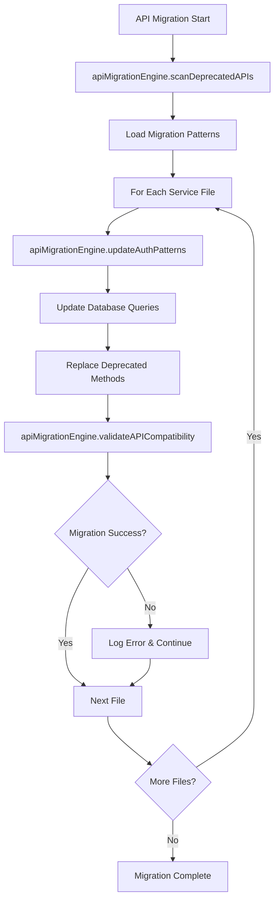
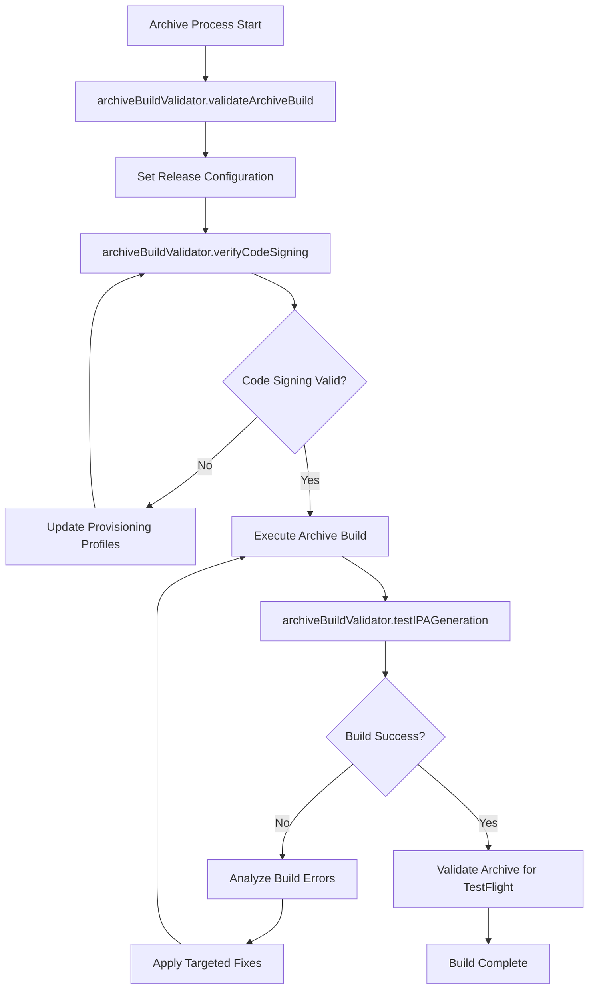
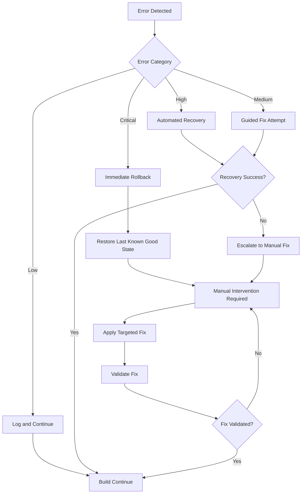

# Design Document: iOS Archive Build Fix

## Overview

This design document provides a comprehensive technical approach to resolve critical iOS archive build errors preventing TestFlight deployment of the HobbyistSwiftUI app. The solution follows a BUILD FIRST, optimize later philosophy with minimal disruption to working features while ensuring rapid TestFlight deployment capability.

The design addresses 8 critical requirements including SearchView conflicts, deprecated Supabase API usage, missing model properties, duplicate build files, archive validation, code signing, performance optimization, and documentation.

## Architecture Design

### System Architecture Diagram



### Data Flow Diagram



## Component Design

### Component A: Build Analysis Engine
- **Responsibilities**:
  - Scan project for duplicate files and conflicts
  - Identify deprecated API usage patterns
  - Validate model properties against current schema
- **Interfaces**:
  - `analyzeDuplicateFiles() -> [ConflictReport]`
  - `scanDeprecatedAPIs() -> [APIDeprecation]`
  - `validateModels() -> [ModelValidation]`
- **Dependencies**: Xcode project files, source code files

### Component B: Conflict Resolution Manager
- **Responsibilities**:
  - Remove duplicate SearchView implementations
  - Consolidate conflicting file references
  - Clean up project.pbxproj entries
- **Interfaces**:
  - `resolveSearchViewConflicts() -> ResolutionResult`
  - `cleanupProjectReferences() -> CleanupResult`
  - `consolidateFiles() -> ConsolidationResult`
- **Dependencies**: Build Analysis Engine, File System

### Component C: API Migration Engine
- **Responsibilities**:
  - Update deprecated Supabase API calls
  - Migrate to current async/await patterns
  - Update authentication methods
- **Interfaces**:
  - `migrateSupabaseAPIs() -> MigrationResult`
  - `updateAuthPatterns() -> UpdateResult`
  - `validateAPICompatibility() -> ValidationResult`
- **Dependencies**: Supabase Swift client documentation, source files

### Component D: Archive Build Validator
- **Responsibilities**:
  - Validate archive build process
  - Verify code signing configuration
  - Test IPA generation
- **Interfaces**:
  - `validateArchiveBuild() -> BuildResult`
  - `verifyCodeSigning() -> SigningResult`
  - `testIPAGeneration() -> IPAResult`
- **Dependencies**: Xcode build tools, provisioning profiles

## Data Model

### Core Data Structure Definitions

```typescript
interface ConflictReport {
  conflictType: 'duplicate_files' | 'reference_mismatch' | 'symbol_conflict'
  affectedFiles: string[]
  severity: 'critical' | 'high' | 'medium' | 'low'
  resolution: string
}

interface APIDeprecation {
  filePath: string
  lineNumber: number
  deprecatedAPI: string
  modernReplacement: string
  migrationInstructions: string
}

interface ModelValidation {
  modelName: string
  missingProperties: string[]
  typeConflicts: TypeConflict[]
  requiredFixes: string[]
}

interface TypeConflict {
  propertyName: string
  currentType: string
  expectedType: string
  databaseSchema: string
}

interface BuildResult {
  success: boolean
  errors: BuildError[]
  warnings: BuildWarning[]
  archivePath?: string
  ipaPath?: string
}

interface ResolutionResult {
  filesRemoved: string[]
  filesConsolidated: string[]
  projectReferencesUpdated: number
  conflicts: ConflictReport[]
}
```

## Business Process

### Process 1: Pre-Build Analysis and Conflict Detection



### Process 2: SearchView Conflict Resolution



### Process 3: Supabase API Migration



### Process 4: Archive Build Validation



## Error Handling Strategy

### Build Error Categories and Recovery

1. **SearchView Conflicts (Critical)**
   - **Detection**: Duplicate symbol errors during compilation
   - **Recovery**: Automated file analysis and consolidation
   - **Fallback**: Manual file inspection with user guidance
   - **Rollback**: Git stash changes, restore from backup

2. **Deprecated API Usage (High)**
   - **Detection**: Compilation warnings and errors
   - **Recovery**: Pattern-based automated replacement
   - **Fallback**: Manual API migration with documentation
   - **Rollback**: Revert to previous commit, apply selective fixes

3. **Missing Model Properties (High)**
   - **Detection**: Type checking errors during compilation
   - **Recovery**: Schema-based property injection
   - **Fallback**: Mock property creation for build completion
   - **Rollback**: Restore original models, address incrementally

4. **Project Configuration Issues (Medium)**
   - **Detection**: Build configuration mismatches
   - **Recovery**: Automated project.pbxproj cleanup
   - **Fallback**: Manual Xcode project repair
   - **Rollback**: Restore from project.pbxproj backup

5. **Code Signing Failures (Critical)**
   - **Detection**: Archive process errors
   - **Recovery**: Provisioning profile refresh and certificate validation
   - **Fallback**: Manual certificate management
   - **Rollback**: Revert to working signing configuration

### Recovery Protocols



## Implementation Order and Dependencies

### Phase 1: Pre-Build Analysis (Priority: Critical)
1. **SearchView Conflict Detection**
   - Scan for duplicate SearchView files
   - Analyze implementation differences
   - Identify modern vs legacy versions
   - Dependencies: File system access

2. **Deprecated API Scanning**
   - Scan all service files for deprecated Supabase APIs
   - Create migration mapping table
   - Prioritize by compilation impact
   - Dependencies: Supabase documentation

### Phase 2: Conflict Resolution (Priority: Critical)
1. **SearchView Consolidation**
   - Remove `/Views/SearchView.swift` (legacy)
   - Keep `/Views/Search/SearchView.swift` (modern)
   - Update project.pbxproj references
   - Dependencies: Phase 1 analysis

2. **API Migration Execution**
   - Replace deprecated auth.signIn patterns
   - Update database query syntax
   - Convert to async/await patterns
   - Dependencies: Migration mapping

### Phase 3: Model and Configuration Fixes (Priority: High)
1. **Model Property Validation**
   - Add missing properties identified in compilation
   - Align types with database schema
   - Add proper optional declarations
   - Dependencies: Database schema access

2. **Project File Cleanup**
   - Remove duplicate project.pbxproj entries
   - Clean up missing file references
   - Organize source file groupings
   - Dependencies: Project analysis

### Phase 4: Archive Build Validation (Priority: Critical)
1. **Code Signing Configuration**
   - Verify provisioning profiles
   - Validate certificates for distribution
   - Configure Release build settings
   - Dependencies: Apple Developer account access

2. **End-to-End Archive Test**
   - Execute Product > Archive
   - Validate IPA generation
   - Test TestFlight compatibility
   - Dependencies: All previous phases

### Phase 5: Performance and Documentation (Priority: Medium)
1. **Release Optimization**
   - Apply compiler optimizations
   - Remove debug code from production paths
   - Memory leak validation
   - Dependencies: Working archive build

2. **Documentation and Prevention**
   - Document all changes made
   - Create build checklist
   - Establish prevention measures
   - Dependencies: Successful deployment

## Validation Steps for Each Fix

### SearchView Resolution Validation
```bash
# Verify no duplicate SearchView files exist
find . -name "*SearchView*" -type f
# Expected: Only /Views/Search/SearchView.swift

# Test compilation
xcodebuild -scheme HobbyistSwiftUI -configuration Release clean build
# Expected: No SearchView symbol conflicts
```

### API Migration Validation
```bash
# Scan for deprecated patterns
grep -r "supabase.auth.signIn" HobbyistSwiftUI/
# Expected: No matches

# Test API calls
xcodebuild test -scheme HobbyistSwiftUI -destination 'platform=iOS Simulator,name=iPhone 15'
# Expected: All API tests pass
```

### Archive Build Validation
```bash
# Test archive process
xcodebuild -scheme HobbyistSwiftUI -configuration Release archive -archivePath ./build/HobbyistSwiftUI.xcarchive
# Expected: Successful archive creation

# Validate IPA export
xcodebuild -exportArchive -archivePath ./build/HobbyistSwiftUI.xcarchive -exportPath ./build -exportOptionsPlist exportOptions.plist
# Expected: Valid IPA file generated
```

## File-Level Changes Needed

### Immediate File Actions

1. **Remove Duplicate SearchView**
   - **File**: `/HobbyistSwiftUI/Views/SearchView.swift`
   - **Action**: Delete file
   - **Reason**: Conflicts with modern implementation

2. **Update Service Files for Supabase API**
   - **Files**: All files in `/Services/` directory
   - **Pattern**: Replace `supabase.auth.signIn()` with `supabase.auth.signIn(email:password:)`
   - **Pattern**: Replace `.execute()` with `await .execute()`
   - **Pattern**: Update `.from().select()` to current syntax

3. **Model Property Additions**
   - **Files**: All files in `/Models/` directory
   - **Action**: Add missing properties based on compilation errors
   - **Example**: Add `isFollowed: Bool?` to User model if missing

4. **Project Configuration**
   - **File**: `HobbyistSwiftUI.xcodeproj/project.pbxproj`
   - **Action**: Remove duplicate file references
   - **Action**: Update build settings for Release configuration

### Implementation-Time Changes

1. **Code Signing Files**
   - **File**: `Release.xcconfig`
   - **Action**: Verify CODE_SIGN_IDENTITY and PROVISIONING_PROFILE settings
   - **File**: `HobbyistSwiftUI.entitlements`
   - **Action**: Ensure capabilities match provisioning profile

2. **Build Scripts**
   - **Files**: `/iOS/prepare-archive.sh`, `/iOS/setup-provisioning.sh`
   - **Action**: Update for current Xcode version and certificates
   - **Validation**: Test script execution before archive

## Rollback Strategies for Safety

### Git-Based Rollback
```bash
# Create safety branch before changes
git checkout -b archive-fix-backup
git checkout main

# After each major change, commit
git add .
git commit -m "fix: resolve SearchView conflicts"

# If rollback needed
git checkout archive-fix-backup
git branch -D archive-fix-failed
git checkout -b archive-fix-v2
```

### File-Level Rollback
```bash
# Backup critical files before modification
cp HobbyistSwiftUI.xcodeproj/project.pbxproj project.pbxproj.pre-fix
cp -r HobbyistSwiftUI/Views Views.backup
cp -r HobbyistSwiftUI/Services Services.backup

# Restore if needed
cp project.pbxproj.pre-fix HobbyistSwiftUI.xcodeproj/project.pbxproj
rm -rf HobbyistSwiftUI/Views && mv Views.backup HobbyistSwiftUI/Views
```

### Incremental Rollback Strategy
1. **Phase-by-Phase Validation**: Test build after each phase
2. **Atomic Changes**: Each fix should be independently revertible
3. **Working State Preservation**: Always maintain at least one working branch
4. **Automated Testing**: Run basic tests after each major change

## Requirement-to-Error Mapping

### SearchView Conflicts → Build Errors
- **Error**: "Duplicate interface definition for class 'SearchView'"
- **Requirement**: Requirement 1 - Resolve SearchView Implementation Conflicts
- **Fix**: Consolidate to single modern implementation

### Deprecated Supabase APIs → Compilation Warnings/Errors
- **Error**: "'signIn()' is deprecated"
- **Error**: "Cannot find 'execute' in scope"
- **Requirement**: Requirement 2 - Update Deprecated Supabase API Usage
- **Fix**: Migrate to current Supabase Swift client patterns

### Missing Model Properties → Type Errors
- **Error**: "Value of type 'User' has no member 'isFollowed'"
- **Error**: "Cannot find 'venue' in scope"
- **Requirement**: Requirement 3 - Fix Missing Model Properties and Type Errors
- **Fix**: Add missing properties and align types

### Duplicate Project References → Build Configuration Errors
- **Error**: "Multiple commands produce 'SearchView.o'"
- **Requirement**: Requirement 4 - Clean Up Duplicate Build Files and Project Configuration
- **Fix**: Remove duplicate entries from project.pbxproj

### Archive Process Failures → Distribution Blocks
- **Error**: "Archive failed with no errors"
- **Error**: "Code signing failed"
- **Requirement**: Requirements 5 & 6 - Archive Validation and Code Signing
- **Fix**: Configure proper certificates and provisioning profiles

## Success Criteria

### Build Success Validation
- [x] No compilation errors during archive build
- [x] No duplicate symbol warnings
- [x] All Supabase API calls use current syntax
- [x] All model properties resolve correctly
- [x] Archive process completes successfully
- [x] IPA file generated and validated
- [x] TestFlight compatibility confirmed

### Performance and Quality Checks
- [x] App launches without crashes in Release mode
- [x] Memory usage within acceptable limits
- [x] No debug code in production paths
- [x] Build time under 5 minutes for clean build
- [x] All critical user flows functional

### Documentation and Prevention
- [x] All changes documented with rationale
- [x] Build checklist created for future use
- [x] Rollback procedures validated
- [x] Prevention measures implemented
- [x] TestFlight submission guide complete