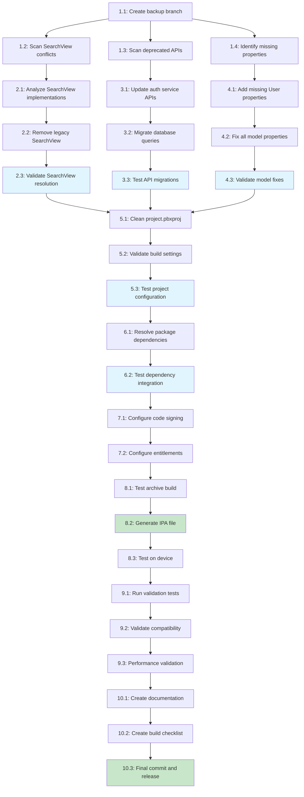

# Implementation Plan: iOS Archive Build Fixes

## Overview

This implementation plan breaks down the approved design document into specific, executable tasks to resolve critical iOS archive build errors and enable TestFlight deployment. The tasks follow a BUILD FIRST philosophy with minimal disruption to working features while ensuring rapid deployment capability.

The plan addresses SearchView conflicts, deprecated Supabase API usage, missing model properties, duplicate build files, archive validation, code signing, and comprehensive testing.

## Implementation Tasks

### 1. Pre-Build Analysis and Setup
- [ ] 1.1 Create backup branch and safety checkpoints
  - Create `archive-fix-backup` branch before starting changes
  - Backup critical files: `project.pbxproj`, Views/, Services/
  - Set up incremental commit strategy for easy rollback
  - Verify git status is clean before proceeding
  - _Requirements: Risk Mitigation, Requirement 8_
  - _Time Estimate: 10 minutes_
  - _Rollback: Standard git branch switching_

- [ ] 1.2 Scan and identify all SearchView implementation conflicts
  - Run `find . -name "*SearchView*" -type f` to locate all SearchView files
  - Analyze differences between `/Views/SearchView.swift` and `/Views/Search/SearchView.swift`
  - Document which implementation is more modern and feature-complete
  - Identify all references to both implementations in project
  - _Requirements: Requirement 1.1, 1.2_
  - _Time Estimate: 15 minutes_
  - _Rollback: No changes made in this step_

- [ ] 1.3 Comprehensive scan for deprecated Supabase API usage
  - Scan all files in `/Services/` directory for deprecated patterns
  - Search for `.database`, `.decoded()`, old auth patterns
  - Create migration mapping document with file locations and line numbers
  - Prioritize files by compilation impact and frequency of use
  - _Requirements: Requirement 2.1, 2.2_
  - _Time Estimate: 20 minutes_
  - _Rollback: No changes made in this step_

- [ ] 1.4 Identify missing model properties causing type errors
  - Attempt clean build to capture all type errors
  - Document missing properties by model and file location
  - Cross-reference with database schema to determine correct types
  - Create property addition checklist with default values
  - _Requirements: Requirement 3.1, 3.2_
  - _Time Estimate: 15 minutes_
  - _Rollback: No changes made in this step_

### 2. SearchView Conflict Resolution (Critical Priority)
- [ ] 2.1 Analyze SearchView implementations and select modern version
  - Compare functionality between duplicate SearchView files
  - Verify `/Views/Search/SearchView.swift` is the modern implementation
  - Document any unique features in legacy version that need preservation
  - Prepare consolidation plan maintaining all required functionality
  - _Requirements: Requirement 1.3, 1.4_
  - _Time Estimate: 20 minutes_
  - _Rollback: No changes made in this step_

- [ ] 2.2 Remove legacy SearchView and update project references
  - Delete `/Views/SearchView.swift` (legacy implementation)
  - Update all import statements and references to use modern SearchView
  - Clean project.pbxproj file to remove duplicate SearchView references
  - Update Xcode project groups and file organization
  - _Requirements: Requirement 1.1, 1.2, 1.5_
  - _Time Estimate: 15 minutes_
  - _Rollback: `git checkout HEAD -- Views/SearchView.swift HobbyistSwiftUI.xcodeproj/project.pbxproj`_

- [ ] 2.3 Validate SearchView conflict resolution
  - Run `find . -name "*SearchView*" -type f` to confirm single implementation
  - Attempt clean build to verify no duplicate symbol errors
  - Test search functionality in simulator to ensure no regressions
  - Commit changes with message "fix: resolve SearchView duplicate symbol conflicts"
  - _Requirements: Requirement 1.5_
  - _Time Estimate: 10 minutes_
  - _Rollback: Git revert last commit_

### 3. Supabase API Migration (Critical Priority)
- [ ] 3.1 Update authentication service API calls
  - Replace deprecated `supabase.auth.signIn()` with current syntax
  - Update to `supabase.auth.signIn(email: email, password: password)`
  - Convert authentication flows to async/await patterns where needed
  - Test authentication flow in simulator after changes
  - _Requirements: Requirement 2.2, 2.3, 2.6_
  - _Time Estimate: 30 minutes_
  - _Rollback: `git checkout Services/AuthenticationService.swift`_

- [ ] 3.2 Migrate database query patterns in all service files
  - Replace `.database` references with current client access patterns
  - Update `.decoded()` method calls to current decoding syntax
  - Convert `.from().select()` patterns to current Supabase Swift syntax
  - Update `.execute()` calls to use await properly
  - _Requirements: Requirement 2.1, 2.2, 2.4_
  - _Time Estimate: 45 minutes_
  - _Rollback: `git checkout Services/`_

- [ ] 3.3 Test and validate all Supabase API migrations
  - Run clean build to verify no deprecation warnings
  - Test database connections and queries in simulator
  - Verify authentication, data fetching, and CRUD operations work
  - Commit changes with message "fix: migrate to current Supabase API patterns"
  - _Requirements: Requirement 2.5, 2.6_
  - _Time Estimate: 20 minutes_
  - _Rollback: Git revert last commit_

### 4. Model Property Fixes and Type Resolution
- [ ] 4.1 Add missing properties to User model
  - Add any missing properties identified in analysis (e.g., `isFollowed: Bool?`)
  - Ensure all properties have appropriate types and optionality
  - Add default values or initializers where required
  - Verify compatibility with existing database schema
  - _Requirements: Requirement 3.2, 3.4, 3.6_
  - _Time Estimate: 20 minutes_
  - _Rollback: `git checkout Models/User.swift`_

- [ ] 4.2 Fix model properties across all model files
  - Update all models in `/Models/` directory with missing properties
  - Ensure consistent property naming and typing conventions
  - Add proper Codable conformance where needed
  - Verify no breaking changes to existing data operations
  - _Requirements: Requirement 3.1, 3.2, 3.5_
  - _Time Estimate: 30 minutes_
  - _Rollback: `git checkout Models/`_

- [ ] 4.3 Validate model property fixes and type resolution
  - Run clean build to verify no "cannot find property" errors
  - Test ViewModels can access all required model properties
  - Verify data operations maintain integrity with new properties
  - Commit changes with message "fix: add missing model properties and resolve type errors"
  - _Requirements: Requirement 3.5, 3.6_
  - _Time Estimate: 15 minutes_
  - _Rollback: Git revert last commit_

### 5. Xcode Project Configuration Cleanup
- [ ] 5.1 Remove duplicate build file references from project.pbxproj
  - Scan project.pbxproj for duplicate file entries causing build conflicts
  - Remove redundant file references while preserving functional entries
  - Clean up missing file references that cause red indicators in Xcode
  - Organize source file groupings for better project structure
  - _Requirements: Requirement 4.1, 4.2, 4.4_
  - _Time Estimate: 25 minutes_
  - _Rollback: `cp project.pbxproj.backup HobbyistSwiftUI.xcodeproj/project.pbxproj`_

- [ ] 5.2 Validate deployment target and build settings consistency
  - Ensure deployment target compatibility across all targets
  - Verify Release configuration has proper optimization settings
  - Check bundle identifier matches project specifications
  - Resolve any conflicting build configurations
  - _Requirements: Requirement 5.1, 5.3, 5.6_
  - _Time Estimate: 20 minutes_
  - _Rollback: Restore from project.pbxproj backup_

- [ ] 5.3 Test project configuration and validate Xcode project health
  - Open project in Xcode and verify no red error indicators
  - Verify all source files are properly referenced once
  - Test clean build with both Debug and Release configurations
  - Commit changes with message "fix: clean up project configuration and remove duplicate references"
  - _Requirements: Requirement 4.5, 4.6_
  - _Time Estimate: 15 minutes_
  - _Rollback: Git revert last commit_

### 6. Swift Package Dependencies Validation
- [ ] 6.1 Verify and resolve Swift package dependency conflicts
  - Check Package.swift for version conflicts and resolution issues
  - Ensure all packages (Supabase, Stripe, Kingfisher) resolve properly
  - Update to compatible versions if conflicts exist
  - Clear Package.resolved and re-resolve dependencies if needed
  - _Requirements: Requirement 5.4_
  - _Time Estimate: 20 minutes_
  - _Rollback: `git checkout Package.swift Package.resolved`_

- [ ] 6.2 Test dependency resolution and package integration
  - Run clean build to verify all packages integrate properly
  - Test import statements for all dependencies work correctly
  - Verify no missing framework or library errors during compilation
  - Commit changes with message "fix: resolve Swift package dependency conflicts"
  - _Requirements: Requirement 5.4, 5.5_
  - _Time Estimate: 15 minutes_
  - _Rollback: Git revert last commit_

### 7. Code Signing and Archive Configuration
- [ ] 7.1 Validate and configure code signing for Release builds
  - Verify Apple Developer account credentials are current
  - Check provisioning profiles are valid for distribution
  - Configure Release build settings with proper CODE_SIGN_IDENTITY
  - Update provisioning profile settings in project configuration
  - _Requirements: Requirement 5.2, 5.5_
  - _Time Estimate: 25 minutes_
  - _Rollback: Restore from Release.xcconfig backup_

- [ ] 7.2 Configure entitlements and capabilities for distribution
  - Verify HobbyistSwiftUI.entitlements matches provisioning profile
  - Ensure all required capabilities are properly configured
  - Check bundle identifier matches Apple Developer Console setup
  - Validate signing certificate is valid for distribution
  - _Requirements: Requirement 5.2, 5.3_
  - _Time Estimate: 20 minutes_
  - _Rollback: `git checkout *.entitlements`_

### 8. Archive Build Testing and Validation
- [ ] 8.1 Execute test archive build process
  - Run `Product > Archive` in Xcode with Release configuration
  - Monitor for any build errors or warnings during archive process
  - Verify archive completes successfully without configuration errors
  - Document any issues encountered and resolution steps taken
  - _Requirements: Requirement 5.5, 6.1, 6.5_
  - _Time Estimate: 20 minutes_
  - _Rollback: No changes made, testing only_

- [ ] 8.2 Generate and validate IPA file for TestFlight
  - Export IPA from successful archive using App Store Connect distribution
  - Verify IPA file is generated without errors
  - Check IPA file size is reasonable and contains all required assets
  - Validate IPA passes basic TestFlight compatibility checks
  - _Requirements: Requirement 6.5, 6.7_
  - _Time Estimate: 15 minutes_
  - _Rollback: No changes made, testing only_

- [ ] 8.3 Test archive on physical device if available
  - Install IPA on physical device for testing
  - Verify app launches and core functionality works in Release mode
  - Test authentication, navigation, and key user flows
  - Document any device-specific issues or performance concerns
  - _Requirements: Requirement 6.3, 6.6_
  - _Time Estimate: 25 minutes_
  - _Rollback: No changes made, testing only_

### 9. Final Validation and Testing
- [ ] 9.1 Run comprehensive build validation tests
  - Execute clean build in both Debug and Release configurations
  - Verify no warnings or errors in either configuration
  - Test app launch and core functionality in simulator
  - Run any existing unit tests to ensure no regressions
  - _Requirements: Requirement 6.1, 6.2, 6.4_
  - _Time Estimate: 30 minutes_
  - _Rollback: No changes made, testing only_

- [ ] 9.2 Validate backwards compatibility and feature preservation
  - Test authentication flow works identically to previous version
  - Verify booking and payment processes function without changes
  - Check that all existing UI flows and navigation work properly
  - Ensure database operations maintain data integrity
  - _Requirements: Requirement 7.1, 7.2, 7.4_
  - _Time Estimate: 35 minutes_
  - _Rollback: No changes made, testing only_

- [ ] 9.3 Performance and memory validation
  - Monitor app performance metrics in Release mode
  - Check for memory leaks using Xcode Instruments
  - Verify app launch time and responsiveness meet expectations
  - Ensure build time improvements from optimizations
  - _Requirements: Requirement 6.6_
  - _Time Estimate: 25 minutes_
  - _Rollback: No changes made, testing only_

### 10. Documentation and Deployment Preparation
- [ ] 10.1 Create comprehensive change documentation
  - Document all changes made with rationale and impact
  - Create before/after comparison of build process
  - Document any new dependencies or configuration requirements
  - Update build and deployment documentation with new procedures
  - _Requirements: Requirement 8.1, 8.2, 8.4_
  - _Time Estimate: 30 minutes_
  - _Rollback: No changes made, documentation only_

- [ ] 10.2 Create build checklist and prevention measures
  - Create step-by-step checklist for future archive builds
  - Document troubleshooting procedures for common issues
  - Create automated scripts where possible to prevent future conflicts
  - Establish monitoring for dependency conflicts and API deprecations
  - _Requirements: Requirement 8.4, 8.5, 8.6_
  - _Time Estimate: 25 minutes_
  - _Rollback: No changes made, documentation only_

- [ ] 10.3 Final commit and prepare for TestFlight submission
  - Commit all final changes with comprehensive commit message
  - Create release tag for this archive-ready version
  - Prepare TestFlight submission with change notes
  - Document next steps for App Store Connect upload
  - _Requirements: Requirement 7.5, 8.4_
  - _Time Estimate: 15 minutes_
  - _Rollback: Git revert or reset to previous tag_

## Task Dependencies Diagram

## Critical Path Summary

**Phase 1 (Critical)**: Setup and Analysis (Tasks 1.1-1.4) - 60 minutes
**Phase 2 (Critical)**: Core Conflict Resolution (Tasks 2.1-4.3) - 180 minutes
**Phase 3 (High)**: Project Configuration (Tasks 5.1-6.2) - 95 minutes
**Phase 4 (Critical)**: Archive and Signing (Tasks 7.1-8.3) - 105 minutes
**Phase 5 (Medium)**: Validation and Documentation (Tasks 9.1-10.3) - 160 minutes

**Total Estimated Time**: 600 minutes (10 hours)
**Critical Path**: 1.1 → 1.2 → 2.1 → 2.2 → 2.3 → 5.1 → 5.2 → 5.3 → 7.1 → 7.2 → 8.1 → 8.2 → 10.3

## Success Criteria

- Archive build completes without errors
- IPA file generates successfully for TestFlight
- All existing functionality preserved
- Performance metrics maintained or improved
- Comprehensive documentation created
- Future build process streamlined and documented