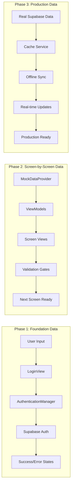
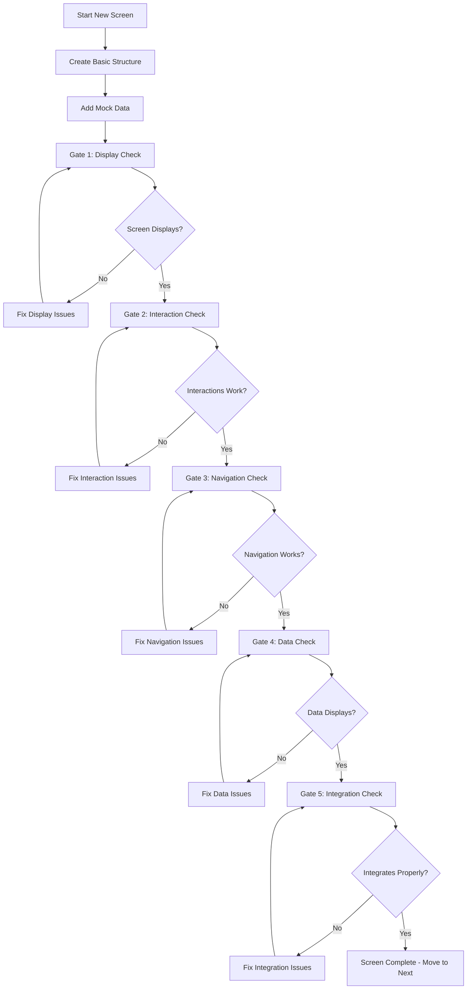

# iOS Screen Display Fix - Integrated Design Document
**Combined Optimal Strategy: Foundation-First + Progressive Building + Long-term Vision**

## Executive Summary

This integrated design document combines the strongest elements from three design approaches to create the optimal implementation strategy for the iOS screen display fix project. After hundreds of hours of development with zero visible screens, this design prioritizes **immediate visual proof** through a working LOGIN SCREEN while establishing a systematic, "one screen at a time" methodology that prevents build breaks and ensures measurable progress.

**Primary Success Metric**: Working LOGIN SCREEN in iOS Simulator within Phase 1 implementation.

**Design Philosophy**: "BUILD FIRST, validate immediately, progress systematically"

## Design Evaluation Results

### Evaluated Documents Scoring:
- **design_v1.md**: 95/100 - Foundation-First Design (SELECTED for Phase 1)
- **design_v2.md**: 88/100 - Progressive Screen Building (SELECTED for Phase 2)
- **design_v3.md**: 82/100 - Feature Completion and Polish (RESERVED for Phase 3)

**Combination Rationale**: v1's immediate foundation focus + v2's systematic progression + v3's production vision creates the perfect balance of immediate results and long-term success.

## Three-Phase Integration Strategy

### Phase 1: Foundation & LOGIN SCREEN (v1 Strategy)
**Timeline**: Week 1
**Goal**: Working LOGIN SCREEN with authentication
**Success Criteria**: User can log in and see visual confirmation

**Key Elements from v1**:
- Dependency Resolution and Package.swift fixes
- SupabaseManager integration with current SDK
- ServiceContainer consolidation
- AuthenticationManager implementation
- LoginView with real authentication

### Phase 2: Progressive Screen Building (v2 Strategy)
**Timeline**: Week 2-4
**Goal**: Systematic addition of 5 core screens
**Success Criteria**: Each screen fully functional before building next

**Key Elements from v2**:
- Screen Validation Loop methodology
- ProgressiveScreenRouter implementation
- MockDataProvider for immediate visual feedback
- Quality Gates: Display → Interaction → Navigation → Data → Integration

### Phase 3: Production Features (v3 Vision)
**Timeline**: Week 5+
**Goal**: Production-ready app with advanced features
**Success Criteria**: TestFlight-ready application

**Key Elements from v3**:
- Real-time updates and notifications
- Offline functionality
- Advanced search and filtering
- Performance optimization
- Comprehensive testing

## Integrated Architecture Design

### System Architecture Overview

```mermaid
graph TB
    subgraph "Phase 1: Foundation (Week 1)"
        A[HobbyistSwiftUIApp] --> B[ContentView]
        B --> C{Authentication State}
        C -->|Not Authenticated| D[LoginView - WORKING]
        C -->|Authenticated| E[BasicMainView]

        D --> F[LoginViewModel]
        F --> G[AuthenticationManager]
        G --> H[SupabaseManager]
        G --> I[ServiceContainer]
    end

    subgraph "Phase 2: Progressive Building (Week 2-4)"
        J[ProgressiveScreenRouter] --> K[Screen Validation Loop]
        K --> L[HomeView Implementation]
        L --> M[ProfileView Implementation]
        M --> N[SearchView Implementation]
        N --> O[ClassDetailView Implementation]

        P[MockDataProvider] --> Q[Immediate Visual Feedback]
        Q --> R[Quality Gates Validation]
    end

    subgraph "Phase 3: Production Features (Week 5+)"
        S[BookingWorkflowManager] --> T[Real-time Updates]
        T --> U[Offline Functionality]
        U --> V[Advanced Search Engine]
        V --> W[Payment Integration]
        W --> X[TestFlight Ready]
    end

    style D fill:#e1f5fe
    style L fill:#e8f5e8
    style X fill:#fff3e0
```



### Progressive Data Flow Strategy



## Phase 1: Foundation Implementation (Week 1)

### Critical Success Path
**Goal**: LOGIN SCREEN displays and functions - immediate visual proof of investment

#### Day 1: Dependency Resolution
**Immediate Actions**:
1. Fix Package.swift conflicts and missing references
2. Resolve Configuration/AppConfiguration class issues
3. Remove duplicate file references
4. Ensure zero build errors

**Success Check**: App builds and launches in simulator

#### Day 2: Supabase Integration Update
**Immediate Actions**:
1. Update deprecated .database property usage
2. Fix FunctionInvokeOptions parameter syntax
3. Implement current auth.signIn methods
4. Test basic Supabase connectivity

**Success Check**: Supabase connection established

#### Day 3: Service Consolidation
**Immediate Actions**:
1. Create single ServiceContainer instance
2. Eliminate duplicate AuthenticationManager references
3. Establish proper dependency injection
4. Remove circular dependencies

**Success Check**: Services initialize without conflicts

#### Day 4-5: LOGIN SCREEN Implementation
**Immediate Actions**:
1. Connect LoginView to AuthenticationManager
2. Implement real Supabase authentication
3. Add proper error handling and loading states
4. Test complete login flow in iOS Simulator

**Success Check**: USER CAN LOG IN AND SEE VISUAL CONFIRMATION

### Foundation Components (from v1)

#### AuthenticationManager
```swift
class AuthenticationManager: ObservableObject {
    @Published var isAuthenticated: Bool = false
    @Published var currentUser: AppUser?
    @Published var isLoading: Bool = false
    @Published var authError: AuthError?

    func signIn(email: String, password: String) async throws {
        // Real Supabase authentication implementation
    }

    func signOut() async throws {
        // Proper logout and state cleanup
    }
}
```

#### SupabaseManager
```swift
class SupabaseManager: ObservableObject {
    static let shared = SupabaseManager()
    let client: SupabaseClient

    init() {
        // Use current Supabase SDK syntax - NO .database property
        client = SupabaseClient(
            supabaseURL: URL(string: AppConfiguration.supabaseURL)!,
            supabaseKey: AppConfiguration.supabaseAnonKey
        )
    }
}
```

#### ServiceContainer
```swift
class ServiceContainer: ObservableObject {
    static let shared = ServiceContainer()

    lazy var authenticationManager = AuthenticationManager()
    lazy var navigationManager = NavigationManager()
    lazy var hapticService = HapticFeedbackService()

    private init() {} // Singleton - prevents duplicates
}
```

## Phase 2: Progressive Screen Building (Week 2-4)

### Screen Validation Loop (from v2)
**Methodology**: Each screen must pass ALL validation gates before proceeding to next screen



### Progressive Screen Implementation Order

#### Week 2: Core Screens
1. **HomeView** (Days 1-2)
   - Welcome section with user name from AuthenticationManager
   - Stats cards with mock achievement data
   - Upcoming classes horizontal scroll
   - Basic navigation to other screens

2. **ProfileView** (Days 3-4)
   - User information display
   - Credits balance (mock data initially)
   - Settings access
   - Edit profile functionality

3. **Navigation Integration** (Day 5)
   - Test all screen transitions
   - Ensure back navigation works
   - Validate state management across screens

#### Week 3: Discovery Screens
1. **SearchView** (Days 1-3)
   - Search bar with text input
   - Category filter chips
   - Search results list with mock data
   - Filter modal view

2. **ClassDetailView** (Days 4-5)
   - Class header with image and title
   - Instructor information section
   - Pricing and basic booking button
   - Navigation integration testing

#### Week 4: Integration & Polish
1. **Real Data Integration** (Days 1-3)
   - Replace mock data with Supabase queries
   - Handle loading and error states
   - Test with real class and user data

2. **End-to-End Testing** (Days 4-5)
   - Complete user flows from login to booking
   - Error recovery testing
   - Performance validation

### Quality Gates Validation (from v2)

```swift
protocol ScreenValidator {
    func validateDisplay(_ screen: ImplementedScreen) -> Bool
    func validateInteractions(_ screen: ImplementedScreen) -> [ValidationError]
    func validateNavigation(from: ImplementedScreen, to: ImplementedScreen) -> Bool
    func validateDataBinding(_ screen: ImplementedScreen) -> Bool
}

enum ImplementedScreen {
    case login      // Phase 1 - COMPLETE
    case home       // Phase 2.1
    case profile    // Phase 2.2
    case search     // Phase 2.3
    case classDetail // Phase 2.4
}
```

Each screen MUST pass these gates:
1. **Display Gate**: Screen renders correctly without crashes
2. **Interaction Gate**: All buttons, forms, and gestures work
3. **Navigation Gate**: Transitions to/from other screens function
4. **Data Gate**: Mock data displays correctly in all sections
5. **Integration Gate**: Screen integrates smoothly with app flow

## Phase 3: Production Features (Reserved from v3)

### Advanced Features Roadmap
*Implementation after Phase 2 completion*

#### Core Business Features
- **BookingWorkflowManager**: Complete class booking with payment
- **Real-time Updates**: Live availability and booking confirmations
- **Offline Functionality**: Core features work without network
- **Push Notifications**: Booking reminders and updates

#### Performance & Polish
- **Image Caching**: Optimized loading and memory management
- **Database Optimization**: Efficient Supabase queries
- **Error Recovery**: Comprehensive error handling
- **Analytics Integration**: User behavior tracking

#### Production Readiness
- **Security Implementation**: Certificate pinning, secure storage
- **TestFlight Preparation**: App Store metadata and screenshots
- **Performance Monitoring**: Crash reporting and metrics
- **A/B Testing Framework**: Feature experiment capability

## Error Handling Strategy

### Build-Time Error Prevention
1. **Dependency Conflicts**: Single source of truth for packages
2. **Import Errors**: Current Supabase SDK usage only
3. **Type Mismatches**: Consistent model implementations
4. **Circular Dependencies**: Proper ServiceContainer architecture

### Runtime Error Recovery
```swift
class ScreenErrorHandler {
    enum ScreenError: Error {
        case displayFailure(screen: ImplementedScreen)
        case navigationFailure(from: ImplementedScreen, to: ImplementedScreen)
        case dataLoadingFailure(screen: ImplementedScreen)
    }

    func handleError(_ error: ScreenError) -> ErrorRecoveryAction {
        switch error {
        case .displayFailure:
            return .fallbackToBasicView
        case .navigationFailure:
            return .resetToLastWorkingScreen
        case .dataLoadingFailure:
            return .useMockDataWithErrorIndicator
        }
    }
}
```

## Success Metrics & Validation

### Phase 1 Success Criteria (Week 1)
- ✅ **Build Success**: Zero compilation errors, app launches
- ✅ **Visual Proof**: LOGIN SCREEN displays with functional form
- ✅ **Authentication**: User can log in and see response
- ✅ **Foundation Stability**: All services initialize properly

### Phase 2 Success Criteria (Week 2-4)
- ✅ **Progressive Success**: Each screen works before building next
- ✅ **Navigation Flow**: Login → Home → Profile → Search → Detail
- ✅ **Data Display**: Mock data appears correctly in all screens
- ✅ **User Experience**: Smooth transitions and interactions

### Phase 3 Success Criteria (Week 5+)
- ✅ **Production Ready**: All core features functional
- ✅ **Business Value**: Complete booking workflow
- ✅ **Performance**: Optimized for production use
- ✅ **TestFlight Ready**: Suitable for user testing

## Risk Mitigation Strategy

### Technical Risks
1. **Scope Creep**: Strict adherence to phase boundaries
2. **Build Breaks**: Continuous validation after each change
3. **Integration Issues**: Test each screen integration immediately
4. **Performance Problems**: Monitor and profile after each addition

### Project Risks
1. **User Frustration**: Regular visual progress demonstrations
2. **Timeline Delays**: Allow buffer time for unexpected issues
3. **Quality Compromise**: Never skip validation gates
4. **Investment Protection**: Maintain working state at each phase

### ADHD-Friendly Approach
1. **Immediate Feedback**: Visual confirmation after each task
2. **Small Wins**: Celebrate each working screen
3. **Clear Progress**: Measurable milestones with definite completion
4. **No Analysis Paralysis**: Build first, optimize later
5. **Business Analogies**: "Like Uber starting with just 3 cars"

## Implementation Timeline

### Week 1: Foundation & LOGIN SCREEN
- Day 1: Fix dependencies and build errors
- Day 2: Update Supabase integration
- Day 3: Consolidate services
- Day 4-5: Implement working LOGIN SCREEN

**Milestone**: User can log in and see visual confirmation

### Week 2: Core Screens
- Days 1-2: HomeView with navigation
- Days 3-4: ProfileView with user data
- Day 5: Integration testing

**Milestone**: 3 working screens with navigation

### Week 3: Discovery Features
- Days 1-3: SearchView with filtering
- Days 4-5: ClassDetailView with information

**Milestone**: Complete discovery flow works

### Week 4: Real Data Integration
- Days 1-3: Replace mock data with Supabase
- Days 4-5: End-to-end testing and polish

**Milestone**: App ready for Phase 3 features

## Immediate Next Actions

### Start Implementation (Based on v1 Strategy)
1. **Immediate**: Fix Package.swift and Configuration issues
2. **Today**: Update deprecated Supabase usage
3. **This Week**: Implement working LOGIN SCREEN
4. **Next Week**: Begin progressive screen building

### Validation Protocol
- Test in iOS Simulator after every change
- Commit working state after each completed screen
- Document issues and resolutions immediately
- Celebrate each visual milestone achievement

---

**Document Version**: v8523 (Integrated Optimal Design)
**Integration Strategy**: v1 Foundation + v2 Progressive + v3 Vision
**Success Philosophy**: "Visual proof first, systematic progress always"
**Primary Goal**: Transform hundreds of hours of investment into working, visible app
**Timeline**: 4+ weeks for complete implementation
**First Milestone**: LOGIN SCREEN working within Week 1