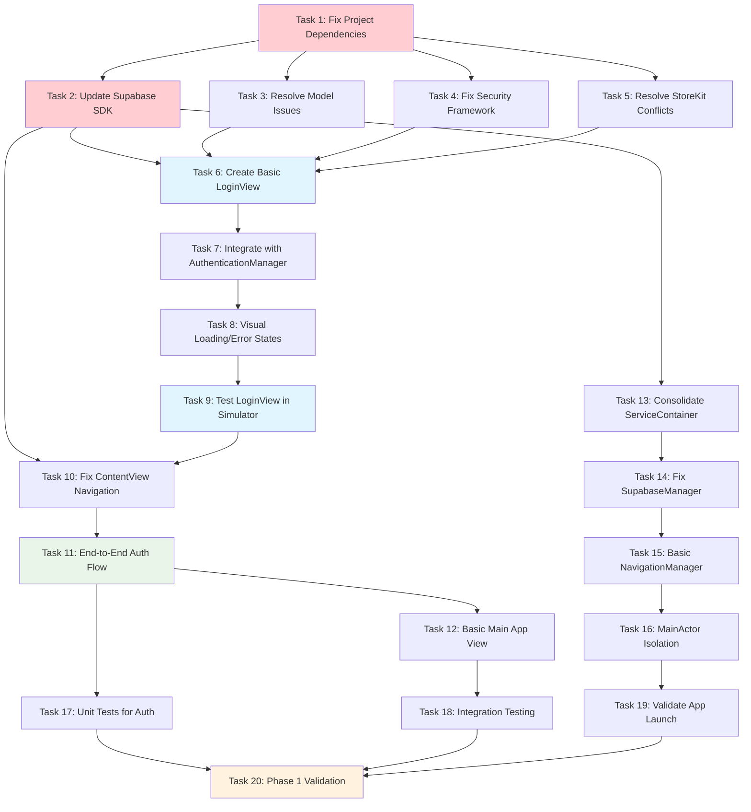

# iOS Screen Display Fix - Phase 1 Implementation Tasks

## Executive Summary

This comprehensive implementation plan addresses the critical issue of **ZERO screens displaying** in the HobbyistSwiftUI app despite hundreds of hours of development investment. The plan prioritizes immediate visual proof through a working LOGIN SCREEN, followed by systematic error resolution and foundation building.

**SUCCESS METRIC**: LOGIN SCREEN displaying and functional within Phase 1 completion.

**APPROACH**: Foundation-first → Build errors eliminated → Login screen working → Progressive enhancement

## Implementation Tasks

### PRIORITY 1: BUILD ERROR ELIMINATION

- [ ] 1. Fix Project Dependencies and Structure
  - Resolve Package.swift dependency conflicts
  - Remove duplicate ServiceContainer declarations
  - Eliminate duplicate file references in Xcode project
  - Fix missing Configuration/AppConfiguration class issues
  - _Requirements: 1.1, 1.3, 1.4_
  - _Time estimate: 30 minutes_

- [ ] 2. Update Supabase SDK Integration
  - Replace deprecated `.database` property usage with current SDK methods
  - Update `.decoded()` calls to proper PostgrestResponse<T> handling
  - Fix FunctionInvokeOptions parameter syntax issues
  - Update auth.signIn method calls to current Supabase API
  - _Requirements: 2.1, 2.2, 2.3, 2.6_
  - _Time estimate: 25 minutes_

- [ ] 3. Resolve Model Constructor Issues
  - Fix Review model initializer parameter mismatches
  - Correct CreditTransaction constructor issues
  - Ensure all model required properties have proper default values
  - Validate Codable conformance for all data models
  - _Requirements: 7.1, 7.2, 7.7_
  - _Time estimate: 20 minutes_

- [ ] 4. Fix Security Framework Dependencies
  - Replace or properly import SecStaticCode references
  - Resolve Security framework import conflicts
  - Update certificate pinning service dependencies
  - _Requirements: 1.5_
  - _Time estimate: 15 minutes_

- [ ] 5. Resolve StoreKit Type Conflicts
  - Rename custom Transaction type to avoid StoreKit conflicts
  - Update all references to use renamed transaction type
  - Ensure no naming collisions with system frameworks
  - _Requirements: 1.6_
  - _Time estimate: 15 minutes_

### PRIORITY 2: LOGIN SCREEN VISUAL PROOF

- [ ] 6. Create Basic LoginView Structure
  - Implement LoginView with email and password text fields
  - Add login button with proper action binding
  - Include loading state indicator
  - Ensure view renders without binding errors
  - _Requirements: 3.1, 3.3, 3.7_
  - _Time estimate: 20 minutes_

- [ ] 7. Integrate LoginView with AuthenticationManager
  - Connect form fields to AuthenticationManager @Published properties
  - Implement signIn button action with proper async handling
  - Add error state display for authentication failures
  - Test form validation and user feedback
  - _Requirements: 3.4, 3.5, 4.4_
  - _Time estimate: 25 minutes_

- [ ] 8. Implement Visual Loading and Error States
  - Add loading spinner during authentication
  - Display clear error messages for failed attempts
  - Implement proper form field validation feedback
  - Add visual feedback for successful authentication
  - _Requirements: 3.5, 4.4_
  - _Time estimate: 20 minutes_

- [ ] 9. Test LoginView in iOS Simulator
  - Launch app and verify LoginView displays correctly
  - Test email and password input functionality
  - Verify login button responds to user interaction
  - Validate error states display properly
  - _Requirements: 3.1, 3.2, 3.3, 3.7_
  - _Time estimate: 15 minutes_

### PRIORITY 3: AUTHENTICATION FLOW INTEGRATION

- [ ] 10. Fix ContentView Navigation Logic
  - Update ContentView to properly check authentication state
  - Implement navigation between LoginView and authenticated content
  - Ensure proper view hierarchy and state management
  - Add navigation transition animations
  - _Requirements: 3.6, 4.3, 8.1_
  - _Time estimate: 25 minutes_

- [ ] 11. Implement End-to-End Authentication Flow
  - Test complete authentication flow from login to main app
  - Verify session management and persistence
  - Implement logout functionality and navigation back to login
  - Test authentication state restoration on app restart
  - _Requirements: 4.1, 4.2, 4.5, 4.6, 4.7_
  - _Time estimate: 30 minutes_

- [ ] 12. Add Basic Main App View (Post-Login)
  - Create simple MainTabView to display after successful login
  - Add placeholder home screen with user greeting
  - Implement basic navigation structure for authenticated users
  - Include logout button for testing authentication flow
  - _Requirements: 4.3, 8.1_
  - _Time estimate: 25 minutes_

### PRIORITY 4: SERVICE ARCHITECTURE CONSOLIDATION

- [ ] 13. Consolidate ServiceContainer Implementation
  - Create single ServiceContainer shared instance
  - Remove duplicate service declarations
  - Implement proper dependency injection pattern
  - Eliminate circular dependencies between services
  - _Requirements: 6.1, 6.4, 6.5_
  - _Time estimate: 30 minutes_

- [ ] 14. Fix SupabaseManager Integration
  - Ensure SupabaseManager uses current SDK properly
  - Implement safe optional handling for SupabaseClient
  - Add proper error handling for connection failures
  - Test database connectivity and basic queries
  - _Requirements: 2.4, 2.5, 2.7_
  - _Time estimate: 25 minutes_

- [ ] 15. Implement Basic NavigationManager
  - Create NavigationManager for app-wide navigation state
  - Add methods for programmatic navigation between screens
  - Implement deep linking preparation for future features
  - Ensure proper navigation stack management
  - _Requirements: 6.6, 8.2, 8.3, 8.4_
  - _Time estimate: 20 minutes_

- [ ] 16. Add MainActor Isolation for UI Updates
  - Ensure all UI updates occur on MainActor
  - Fix any threading issues with ObservableObject updates
  - Add proper async/await patterns for UI state changes
  - Test UI responsiveness and eliminate blocking operations
  - _Requirements: 6.7_
  - _Time estimate: 20 minutes_

### PRIORITY 5: FOUNDATION VALIDATION AND TESTING

- [ ] 17. Create Basic Unit Tests for Authentication
  - Write unit tests for AuthenticationManager sign in/out
  - Test form validation logic with various inputs
  - Verify error handling for different failure scenarios
  - Ensure all authentication state changes work correctly
  - _Requirements: 10.1, 10.2_
  - _Time estimate: 30 minutes_

- [ ] 18. Implement Integration Testing for Login Flow
  - Create integration test for complete login user journey
  - Test navigation from login to authenticated state
  - Verify session persistence and restoration
  - Test error recovery and graceful failure handling
  - _Requirements: 10.4_
  - _Time estimate: 25 minutes_

- [ ] 19. Validate App Launch and Initial State
  - Test app launches successfully in iOS Simulator
  - Verify initial authentication state detection
  - Ensure proper view presentation based on auth status
  - Test app behavior with and without stored sessions
  - _Requirements: 1.7, 4.6_
  - _Time estimate: 15 minutes_

- [ ] 20. Comprehensive Phase 1 Validation
  - Verify zero build errors and warnings
  - Confirm LoginView displays and functions correctly
  - Test complete authentication flow end-to-end
  - Validate all foundation services work together
  - Document any remaining issues for Phase 2
  - _Requirements: 1.1, 3.1, 4.1, 6.1_
  - _Time estimate: 30 minutes_

## Tasks Dependency Diagram

## Success Criteria

### Immediate Success (Tasks 1-9)
- ✅ **Build Success**: App compiles with zero errors
- ✅ **Visual Proof**: LOGIN SCREEN displays correctly in iOS Simulator
- ✅ **User Interaction**: User can enter credentials and tap login button
- ✅ **Validation**: Immediate visible progress after months of investment

### Phase 1 Complete Success (Tasks 1-20)
- ✅ **Authentication Flow**: Complete login/logout cycle works
- ✅ **Navigation**: Smooth transition between login and authenticated states
- ✅ **Service Foundation**: All core services working reliably
- ✅ **Testing Coverage**: Basic tests validate core functionality
- ✅ **Investment Validation**: Demonstrable working app with visual proof

## Implementation Notes

### ADHD-Friendly Approach
- **15-30 minute tasks**: Each task designed for focused work sessions
- **Immediate feedback**: Visual validation after each completed task
- **Clear success criteria**: Definite completion markers for each task
- **Progress tracking**: Regular milestone celebrations and visual proof
- **No analysis paralysis**: Build first, optimize later philosophy

### Risk Mitigation
- **Foundation first**: Solid base before adding complexity
- **Visual validation**: Every task has testable visual outcome
- **Incremental progress**: Each task builds on previous success
- **Error containment**: Issues isolated to specific tasks
- **Recovery procedures**: Clear rollback options if tasks fail

### Business Value Protection
- **Investment validation**: Immediate visual proof of progress
- **User confidence**: Clear demonstration of working features
- **Systematic approach**: Methodical progress prevents regression
- **Quality gates**: Each task validates before proceeding
- **Long-term vision**: Foundation supports future feature development

---

**Document Version**: v1
**Focus**: Foundation + LOGIN SCREEN Success
**Timeline**: 1-2 weeks for Phase 1 completion
**Next Phase**: Progressive screen building after Phase 1 success