# iOS Screen Display Fix - Phase 2: Progressive Screen Building Implementation Tasks

## Implementation Strategy: "Slow, One Screen at a Time"

**Critical Success Pattern**: Each screen must DISPLAY → INTERACT → NAVIGATE → INTEGRATE before moving to the next screen. This prevents build breaks and ensures measurable progress after login screen success.

**Phase 2 Goal**: Transform working LOGIN SCREEN into complete navigable app interface with 5 core screens.

---

## Screen Implementation Order & Task Breakdown

### 🏠 Screen 1: HomeView - Main Dashboard (Days 1-2)

- [ ] 1. Create HomeView basic structure and layout
  - Create HomeView.swift with basic NavigationView structure
  - Add welcome header section with authenticated user name
  - Include stats cards placeholder section (classes taken, credits remaining)
  - Add upcoming classes horizontal scroll placeholder
  - **Screen focus**: HomeView - Basic layout foundation
  - **Dependencies**: Working LoginView and authentication state
  - **Files to create/modify**: `/HobbyistSwiftUI/Views/HomeView.swift`
  - **Success criteria**: HomeView displays without crashes, basic sections visible
  - **Validation**: Navigate from LoginView to HomeView in Simulator
  - **Time estimate**: 20 minutes

- [ ] 1.1 Add HomeView mock data display
  - Connect to HomeViewModel for data binding
  - Implement mock data provider for immediate visual feedback
  - Add achievement stats with placeholder numbers
  - Display upcoming classes list with mock class data
  - **Screen focus**: HomeView - Data integration
  - **Dependencies**: Task 1 completed
  - **Files to create/modify**: `/HobbyistSwiftUI/ViewModels/HomeViewModel.swift` (update)
  - **Success criteria**: Mock data appears in all sections, no binding errors
  - **Validation**: Scroll through upcoming classes, see stats update
  - **Time estimate**: 25 minutes

- [ ] 1.2 Implement HomeView navigation actions
  - Add navigation buttons to profile, search, and bookings
  - Connect navigation actions to ProgressiveScreenRouter
  - Test tap gestures on cards and list items
  - Verify navigation state management
  - **Screen focus**: HomeView - Navigation integration
  - **Dependencies**: Task 1.1 completed
  - **Files to create/modify**: `/HobbyistSwiftUI/Services/ProgressiveScreenRouter.swift`
  - **Success criteria**: All navigation buttons work, proper screen transitions
  - **Validation**: Tap each navigation element, verify destination reached
  - **Time estimate**: 30 minutes

- [ ] 1.3 HomeView quality gate validation
  - Run complete HomeView display validation
  - Test all user interactions (taps, scrolls, navigation)
  - Verify data displays correctly in all sections
  - Confirm integration with authentication state
  - **Screen focus**: HomeView - Complete validation
  - **Dependencies**: Tasks 1.0-1.2 completed
  - **Files to create/modify**: None (validation only)
  - **Success criteria**: All 5 quality gates pass (Display, Interaction, Navigation, Data, Integration)
  - **Validation**: Complete user journey from login to home, all features working
  - **Time estimate**: 15 minutes

### 👤 Screen 2: ProfileView - User Information (Days 3-4)

- [ ] 2. Create ProfileView structure and user information display
  - Build ProfileView.swift with user info section
  - Add profile picture placeholder and user details
  - Include credits balance display with mock data
  - Add settings navigation button
  - **Screen focus**: ProfileView - User information layout
  - **Dependencies**: HomeView completed (Task 1.3)
  - **Files to create/modify**: `/HobbyistSwiftUI/Views/ProfileView.swift` (update)
  - **Success criteria**: ProfileView displays user info, credits, and settings access
  - **Validation**: Navigate to ProfileView from HomeView, see user data
  - **Time estimate**: 25 minutes

- [ ] 2.1 Add ProfileView credits and achievements section
  - Connect to ProfileViewModel for user data binding
  - Display user's credit balance and transaction history
  - Add achievements and progress indicators
  - Include booking history preview section
  - **Screen focus**: ProfileView - Credits and achievements
  - **Dependencies**: Task 2 completed
  - **Files to create/modify**: `/HobbyistSwiftUI/ViewModels/ProfileViewModel.swift` (update)
  - **Success criteria**: Credits section shows balance, achievements display correctly
  - **Validation**: See credits updating, achievements showing progress
  - **Time estimate**: 30 minutes

- [ ] 2.2 Implement ProfileView edit functionality
  - Add edit profile button and modal view
  - Include form fields for user information editing
  - Add save/cancel actions with proper state management
  - Connect form validation and submission
  - **Screen focus**: ProfileView - Edit functionality
  - **Dependencies**: Task 2.1 completed
  - **Files to create/modify**: `/HobbyistSwiftUI/Views/Profile/EditProfileView.swift`
  - **Success criteria**: Edit modal opens, form fields work, save/cancel functions
  - **Validation**: Edit profile information, save changes, see updates
  - **Time estimate**: 35 minutes

- [ ] 2.3 ProfileView quality gate validation
  - Validate ProfileView displays correctly from navigation
  - Test edit profile workflow end-to-end
  - Verify credits and achievements data integration
  - Confirm proper back navigation to previous screens
  - **Screen focus**: ProfileView - Complete validation
  - **Dependencies**: Tasks 2.0-2.2 completed
  - **Files to create/modify**: None (validation only)
  - **Success criteria**: All 5 quality gates pass for ProfileView
  - **Validation**: Complete profile management workflow works smoothly
  - **Time estimate**: 15 minutes

### 🔍 Screen 3: SearchView - Class Discovery (Days 5-6)

- [ ] 3. Create SearchView layout with search and filter components
  - Build SearchView.swift with search bar and results list
  - Add category filter chips (fitness, art, cooking, etc.)
  - Include search results list with mock class data
  - Add filter modal access button
  - **Screen focus**: SearchView - Search interface layout
  - **Dependencies**: ProfileView completed (Task 2.3)
  - **Files to create/modify**: `/HobbyistSwiftUI/Views/SearchView.swift` (update)
  - **Success criteria**: Search interface displays, filter chips work, results list shows
  - **Validation**: Navigate to SearchView, see search bar and filters
  - **Time estimate**: 30 minutes

- [ ] 3.1 Implement SearchView filtering and results display
  - Connect to SearchViewModel for search logic
  - Add category filtering functionality
  - Display filtered search results with mock data
  - Include location and price range filtering
  - **Screen focus**: SearchView - Search functionality
  - **Dependencies**: Task 3 completed
  - **Files to create/modify**: `/HobbyistSwiftUI/ViewModels/SearchViewModel.swift` (update)
  - **Success criteria**: Search and filtering work, results update dynamically
  - **Validation**: Search for classes, apply filters, see results change
  - **Time estimate**: 35 minutes

- [ ] 3.2 Add SearchView filter modal and advanced options
  - Create FilterModalView with advanced filtering options
  - Add location radius, price range, and time filters
  - Include apply/reset filter actions
  - Connect filter state to search results
  - **Screen focus**: SearchView - Advanced filtering
  - **Dependencies**: Task 3.1 completed
  - **Files to create/modify**: `/HobbyistSwiftUI/Views/Search/FilterModalView.swift`
  - **Success criteria**: Filter modal opens, advanced filters work, results update
  - **Validation**: Open filter modal, set filters, see search results change
  - **Time estimate**: 30 minutes

- [ ] 3.3 SearchView quality gate validation
  - Test complete search workflow from query to results
  - Validate all filter combinations work correctly
  - Verify search results navigation to class details
  - Confirm proper integration with app navigation flow
  - **Screen focus**: SearchView - Complete validation
  - **Dependencies**: Tasks 3.0-3.2 completed
  - **Files to create/modify**: None (validation only)
  - **Success criteria**: All 5 quality gates pass for SearchView
  - **Validation**: Complete search and discovery workflow functions
  - **Time estimate**: 20 minutes

### 📋 Screen 4: ClassDetailView - Individual Class Information (Days 7-8)

- [ ] 4. Create ClassDetailView structure and class information display
  - Build ClassDetailView.swift with class header and image
  - Add class title, description, and pricing information
  - Include instructor details section
  - Add venue information and location display
  - **Screen focus**: ClassDetailView - Class information layout
  - **Dependencies**: SearchView completed (Task 3.3)
  - **Files to create/modify**: `/HobbyistSwiftUI/Views/ClassDetailView.swift` (update)
  - **Success criteria**: Class details display correctly, all information sections present
  - **Validation**: Navigate from SearchView to ClassDetailView, see class info
  - **Time estimate**: 25 minutes

- [ ] 4.1 Add ClassDetailView booking section and actions
  - Connect to ClassDetailViewModel for class data
  - Add booking button with pricing display
  - Include available time slots selection
  - Add add-to-favorites functionality
  - **Screen focus**: ClassDetailView - Booking interface
  - **Dependencies**: Task 4 completed
  - **Files to create/modify**: `/HobbyistSwiftUI/ViewModels/ClassDetailViewModel.swift` (update)
  - **Success criteria**: Booking section displays, time slots selectable, favorite works
  - **Validation**: Select time slot, tap booking button, add to favorites
  - **Time estimate**: 30 minutes

- [ ] 4.2 Implement ClassDetailView reviews and instructor info
  - Add instructor profile section with bio and ratings
  - Include class reviews and ratings display
  - Add review submission form (basic implementation)
  - Connect instructor profile navigation
  - **Screen focus**: ClassDetailView - Social features
  - **Dependencies**: Task 4.1 completed
  - **Files to create/modify**: `/HobbyistSwiftUI/Views/ClassDetail/InstructorProfileView.swift`
  - **Success criteria**: Instructor info displays, reviews show, review form works
  - **Validation**: View instructor profile, read reviews, submit test review
  - **Time estimate**: 35 minutes

- [ ] 4.3 ClassDetailView quality gate validation
  - Validate complete class detail display and functionality
  - Test booking workflow (without payment processing)
  - Verify instructor and review sections work correctly
  - Confirm navigation integration with other screens
  - **Screen focus**: ClassDetailView - Complete validation
  - **Dependencies**: Tasks 4.0-4.2 completed
  - **Files to create/modify**: None (validation only)
  - **Success criteria**: All 5 quality gates pass for ClassDetailView
  - **Validation**: Complete class discovery to booking workflow works
  - **Time estimate**: 15 minutes

### 🚀 Screen 5: OnboardingView - Welcome Flow (Days 9-10)

- [ ] 5. Create OnboardingView welcome flow structure
  - Build OnboardingView.swift with multi-step welcome flow
  - Add welcome screen with app introduction
  - Include feature highlights carousel
  - Add location permission request screen
  - **Screen focus**: OnboardingView - Welcome flow layout
  - **Dependencies**: ClassDetailView completed (Task 4.3)
  - **Files to create/modify**: `/HobbyistSwiftUI/Views/Auth/OnboardingView.swift` (update)
  - **Success criteria**: Onboarding flow displays, multiple screens navigate correctly
  - **Validation**: Start fresh app install flow, see onboarding screens
  - **Time estimate**: 30 minutes

- [ ] 5.1 Implement OnboardingView feature introduction and permissions
  - Add feature showcase screens (search, booking, social)
  - Include permission requests (location, notifications)
  - Add skip/continue navigation between screens
  - Connect final screen to main app flow
  - **Screen focus**: OnboardingView - Feature introduction
  - **Dependencies**: Task 5 completed
  - **Files to create/modify**: `/HobbyistSwiftUI/ViewModels/OnboardingViewModel.swift`
  - **Success criteria**: Feature showcase works, permissions request properly
  - **Validation**: Go through complete onboarding, grant permissions
  - **Time estimate**: 25 minutes

- [ ] 5.2 OnboardingView quality gate validation and integration
  - Test complete onboarding flow for new users
  - Validate permission handling and app integration
  - Verify onboarding skip functionality works
  - Confirm proper transition to authenticated app state
  - **Screen focus**: OnboardingView - Complete validation
  - **Dependencies**: Tasks 5.0-5.1 completed
  - **Files to create/modify**: None (validation only)
  - **Success criteria**: All 5 quality gates pass for OnboardingView
  - **Validation**: Complete new user onboarding experience works end-to-end
  - **Time estimate**: 20 minutes

---

## Integration & Validation Tasks

### 🔗 Navigation Integration (Day 11)

- [ ] 6. Implement ProgressiveScreenRouter for seamless navigation
  - Create centralized navigation manager for all screen transitions
  - Add navigation state management across app screens
  - Include deep linking support for specific screens
  - Add navigation history and back button handling
  - **Screen focus**: All screens - Navigation integration
  - **Dependencies**: All individual screens completed (Tasks 1.3-5.2)
  - **Files to create/modify**: `/HobbyistSwiftUI/Services/ProgressiveScreenRouter.swift`
  - **Success criteria**: All navigation between screens works smoothly
  - **Validation**: Navigate through entire app flow, test all transitions
  - **Time estimate**: 40 minutes

- [ ] 6.1 Add MockDataProvider for consistent cross-screen data
  - Create centralized mock data service for development
  - Add realistic class, user, and booking data
  - Include data consistency across all screens
  - Add data state management for screen interactions
  - **Screen focus**: All screens - Data integration
  - **Dependencies**: Task 6 completed
  - **Files to create/modify**: `/HobbyistSwiftUI/Services/MockDataProvider.swift`
  - **Success criteria**: Consistent mock data appears across all screens
  - **Validation**: Navigate between screens, see consistent data relationships
  - **Time estimate**: 30 minutes

### 🧪 End-to-End Validation (Day 12)

- [ ] 7. Complete app flow validation from login to booking
  - Test entire user journey: Login → Home → Search → Class Detail → Booking
  - Validate all screen transitions work without crashes
  - Verify data displays consistently across all screens
  - Confirm all user interactions function as expected
  - **Screen focus**: Complete app - End-to-end validation
  - **Dependencies**: All previous tasks completed (6.1)
  - **Files to create/modify**: None (validation only)
  - **Success criteria**: Complete user journey works without errors
  - **Validation**: Full app walkthrough in iOS Simulator works perfectly
  - **Time estimate**: 45 minutes

- [ ] 7.1 Performance optimization and error handling
  - Add loading states for all screen transitions
  - Include error boundaries for screen display failures
  - Add fallback views for missing or failed data
  - Optimize screen rendering and memory usage
  - **Screen focus**: All screens - Performance and reliability
  - **Dependencies**: Task 7 completed
  - **Files to create/modify**: `/HobbyistSwiftUI/Utils/ScreenErrorHandler.swift`
  - **Success criteria**: App handles errors gracefully, performs smoothly
  - **Validation**: Test error scenarios, verify app remains stable
  - **Time estimate**: 35 minutes

- [ ] 7.2 Final quality assurance and documentation
  - Complete final testing of all implemented screens
  - Document any known issues or limitations
  - Create user guide for implemented features
  - Prepare progress report for next phase planning
  - **Screen focus**: Complete app - Final validation
  - **Dependencies**: Task 7.1 completed
  - **Files to create/modify**: Progress documentation
  - **Success criteria**: All screens functional, ready for Phase 3 planning
  - **Validation**: App ready for real data integration and advanced features
  - **Time estimate**: 30 minutes

---

## Quality Gates Validation Protocol

### 📋 Gate 1: Display Validation
**Criteria**: Screen renders correctly without crashes
- [ ] Screen displays all expected UI elements
- [ ] No layout errors or missing components
- [ ] Proper spacing and visual hierarchy
- [ ] Responsive design works on different screen sizes

### 🎯 Gate 2: Interaction Validation
**Criteria**: All user interactions function properly
- [ ] Buttons and taps register correctly
- [ ] Form inputs accept and validate data
- [ ] Gestures (scroll, swipe) work smoothly
- [ ] Loading states display during actions

### 🧭 Gate 3: Navigation Validation
**Criteria**: Screen integrates with app navigation flow
- [ ] Navigation to screen works from previous screens
- [ ] Back navigation returns to correct previous screen
- [ ] Tab navigation (if applicable) functions
- [ ] Modal presentations and dismissals work

### 📊 Gate 4: Data Validation
**Criteria**: Data displays correctly and updates properly
- [ ] Mock data appears in all screen sections
- [ ] Data binding works without errors
- [ ] Data updates reflect in UI immediately
- [ ] No data loading or binding errors

### 🔗 Gate 5: Integration Validation
**Criteria**: Screen works seamlessly with overall app flow
- [ ] Authentication state is respected
- [ ] Screen fits logically in user workflow
- [ ] No conflicts with other implemented screens
- [ ] Proper state management across screen transitions

---

## Tasks Dependency Diagram

```mermaid
flowchart TD
    T1[Task 1: Create HomeView basic structure]
    T1_1[Task 1.1: Add HomeView mock data]
    T1_2[Task 1.2: Implement HomeView navigation]
    T1_3[Task 1.3: HomeView quality gate validation]

    T2[Task 2: Create ProfileView structure]
    T2_1[Task 2.1: Add ProfileView credits section]
    T2_2[Task 2.2: Implement ProfileView edit functionality]
    T2_3[Task 2.3: ProfileView quality gate validation]

    T3[Task 3: Create SearchView layout]
    T3_1[Task 3.1: Implement SearchView filtering]
    T3_2[Task 3.2: Add SearchView filter modal]
    T3_3[Task 3.3: SearchView quality gate validation]

    T4[Task 4: Create ClassDetailView structure]
    T4_1[Task 4.1: Add ClassDetailView booking section]
    T4_2[Task 4.2: Implement ClassDetailView reviews]
    T4_3[Task 4.3: ClassDetailView quality gate validation]

    T5[Task 5: Create OnboardingView welcome flow]
    T5_1[Task 5.1: Implement OnboardingView features]
    T5_2[Task 5.2: OnboardingView quality gate validation]

    T6[Task 6: Implement ProgressiveScreenRouter]
    T6_1[Task 6.1: Add MockDataProvider]

    T7[Task 7: Complete app flow validation]
    T7_1[Task 7.1: Performance optimization]
    T7_2[Task 7.2: Final quality assurance]

    T1 --> T1_1
    T1_1 --> T1_2
    T1_2 --> T1_3

    T1_3 --> T2
    T2 --> T2_1
    T2_1 --> T2_2
    T2_2 --> T2_3

    T2_3 --> T3
    T3 --> T3_1
    T3_1 --> T3_2
    T3_2 --> T3_3

    T3_3 --> T4
    T4 --> T4_1
    T4_1 --> T4_2
    T4_2 --> T4_3

    T4_3 --> T5
    T5 --> T5_1
    T5_1 --> T5_2

    T5_2 --> T6
    T6 --> T6_1

    T6_1 --> T7
    T7 --> T7_1
    T7_1 --> T7_2

    style T1_3 fill:#e1f5fe
    style T2_3 fill:#e1f5fe
    style T3_3 fill:#e1f5fe
    style T4_3 fill:#e1f5fe
    style T5_2 fill:#e1f5fe
    style T7_2 fill:#c8e6c9
```

---

## Success Metrics & Progress Tracking

### 📊 Screen Completion Tracking
- **HomeView**: Display ✅ → Interaction ✅ → Navigation ✅ → Data ✅ → Integration ✅
- **ProfileView**: Display ⏳ → Interaction ⏳ → Navigation ⏳ → Data ⏳ → Integration ⏳
- **SearchView**: Display ⏳ → Interaction ⏳ → Navigation ⏳ → Data ⏳ → Integration ⏳
- **ClassDetailView**: Display ⏳ → Interaction ⏳ → Navigation ⏳ → Data ⏳ → Integration ⏳
- **OnboardingView**: Display ⏳ → Interaction ⏳ → Navigation ⏳ → Data ⏳ → Integration ⏳

### 🎯 Milestone Checkpoints
- **Day 2**: HomeView fully functional with navigation
- **Day 4**: ProfileView working with user data management
- **Day 6**: SearchView operational with filtering capabilities
- **Day 8**: ClassDetailView complete with booking interface
- **Day 10**: OnboardingView finished for new user experience
- **Day 12**: Complete app flow validated and performance optimized

### 🚀 Phase 2 Success Criteria
- ✅ **Visual Progress**: 5 working screens with navigation between them
- ✅ **User Experience**: Smooth transitions and interactions throughout app
- ✅ **Data Integration**: Mock data displays consistently across all screens
- ✅ **Quality Assurance**: All screens pass 5-gate validation protocol
- ✅ **Foundation Ready**: App prepared for Phase 3 real data integration

---

**Total Estimated Time**: ~12 days (6 hours/day) = 72 hours
**Approach**: "Slow, one screen at a time, validate everything"
**Success Pattern**: LOGIN SCREEN (Phase 1) → 5 WORKING SCREENS (Phase 2) → PRODUCTION FEATURES (Phase 3)
**Next Phase**: Real Supabase data integration and advanced booking functionality