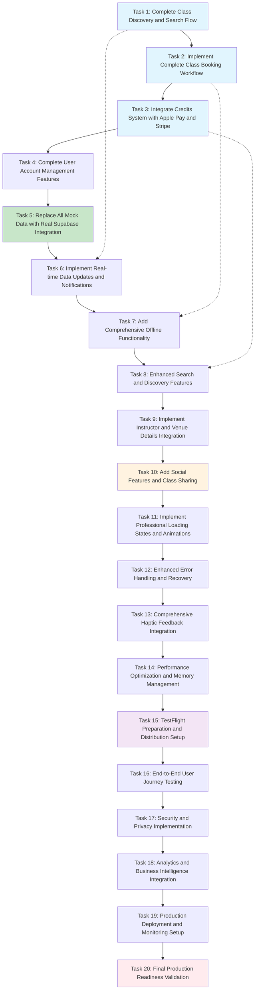

# Implementation Plan - Phase 3: Feature Completion and Polish

**CRITICAL BUSINESS CONTEXT**: Transform hundreds of hours of investment into a complete, production-ready iOS app that real users can download and use to book hobby classes successfully.

**SUCCESS PHILOSOPHY**: "Complete functional app ready for real users" - After Phase 3, users should have a professional app with full booking workflow, payment integration, and production-level polish.

**IMPLEMENTATION APPROACH**: Feature completion tasks (30-45 minutes each), end-to-end workflow validation, production readiness checklist.

## Core Business Workflow Tasks

- [ ] 1. Complete Class Discovery and Search Flow
  - Implement advanced search functionality with filters (category, location, price, time)
  - Add real-time availability checking for class bookings
  - Create location-based search with map integration
  - Implement search result ranking algorithm
  - **Business value**: Users can efficiently discover classes that match their preferences
  - **Dependencies**: Phase 1 & 2 completion (login and basic screens working)
  - **Files to modify**: SearchView.swift, SearchViewModel.swift, LocationService.swift
  - **Success criteria**: Users can search, filter, and find relevant classes within 30 seconds
  - **Validation**: End-to-end search from text input to class selection
  - **Time estimate**: 45 minutes
  - _Requirements: 5, 8, 9_

- [ ] 2. Implement Complete Class Booking Workflow
  - Create booking confirmation flow with class details verification
  - Implement time slot selection with real-time availability
  - Add booking conflict detection and user notifications
  - Create booking confirmation emails/notifications
  - **Business value**: Core revenue-generating functionality - users can successfully book classes
  - **Dependencies**: Task 1 completion, payment system integration
  - **Files to modify**: BookingView.swift, BookingViewModel.swift, BookingService.swift, NotificationService.swift
  - **Success criteria**: Users can book a class from discovery to confirmation without errors
  - **Validation**: Complete booking flow test with real class data
  - **Time estimate**: 45 minutes
  - _Requirements: 9, 1, 4_

- [ ] 3. Integrate Credits System with Apple Pay and Stripe
  - Complete credit purchase flow with Apple Pay integration
  - Implement Stripe payment processing for credit packages
  - Create credit transaction history and balance management
  - Add automatic credit deduction during booking
  - **Business value**: Users can purchase credits and pay for classes seamlessly
  - **Dependencies**: Task 2 completion, Stripe SDK integration
  - **Files to modify**: PaymentService.swift, CreditPackageView.swift, PaymentViewModel.swift
  - **Success criteria**: Users can purchase credits and book classes using their credit balance
  - **Validation**: Complete payment flow from credit purchase to class booking
  - **Time estimate**: 45 minutes
  - _Requirements: 9, 1_

- [ ] 4. Complete User Account Management Features
  - Implement comprehensive profile editing (name, email, preferences)
  - Create booking history with detailed past and upcoming classes
  - Add user preferences and notification settings
  - Implement account security features (password change, 2FA)
  - **Business value**: Users can manage their account and track their hobby journey
  - **Dependencies**: Task 3 completion, authentication system
  - **Files to modify**: ProfileView.swift, ProfileViewModel.swift, UserService.swift, SettingsView.swift
  - **Success criteria**: Users can view/edit profile, see booking history, manage preferences
  - **Validation**: Test all profile management flows with real user data
  - **Time estimate**: 40 minutes
  - _Requirements: 7, 8, 10_

- [ ] 5. Replace All Mock Data with Real Supabase Integration
  - Connect all ViewModels to real Supabase data sources
  - Implement comprehensive error handling for network failures
  - Add data caching strategy for offline viewing
  - Create automatic data refresh and sync mechanisms
  - **Business value**: App shows real classes, instructors, and venues instead of placeholder data
  - **Dependencies**: Task 4 completion, Supabase backend ready
  - **Files to modify**: All ViewModels, DataService.swift, CacheService.swift
  - **Success criteria**: All screens display real data from Supabase with proper error handling
  - **Validation**: Test app with various network conditions and data scenarios
  - **Time estimate**: 45 minutes
  - _Requirements: 2, 6, 7_

## Advanced Feature Tasks

- [ ] 6. Implement Real-time Data Updates and Notifications
  - Add real-time class availability updates using Supabase realtime
  - Implement push notifications for booking confirmations and reminders
  - Create live booking updates when classes fill up
  - Add automatic refresh when app becomes active
  - **Business value**: Users see accurate availability and receive important updates
  - **Dependencies**: Task 5 completion, push notification setup
  - **Files to modify**: RealtimeService.swift, NotificationService.swift, all ViewModels
  - **Success criteria**: Users receive timely updates about their bookings and class changes
  - **Validation**: Test notifications and real-time updates in various scenarios
  - **Time estimate**: 40 minutes
  - _Requirements: 2, 8_

- [ ] 7. Add Comprehensive Offline Functionality
  - Implement local data caching for essential app features
  - Create offline browsing for previously viewed classes
  - Add queue system for actions taken while offline
  - Implement smart sync when connection restored
  - **Business value**: Users can browse classes and plan bookings even without internet
  - **Dependencies**: Task 6 completion, caching infrastructure
  - **Files to modify**: CacheService.swift, OfflineManager.swift, all ViewModels
  - **Success criteria**: Core features work offline, actions sync when online
  - **Validation**: Test app functionality with airplane mode on/off
  - **Time estimate**: 45 minutes
  - _Requirements: 8, 10_

- [ ] 8. Enhanced Search and Discovery Features
  - Add intelligent search suggestions and autocomplete
  - Implement personalized class recommendations
  - Create advanced filtering (instructor rating, class difficulty, amenities)
  - Add search history and saved searches
  - **Business value**: Users discover relevant classes faster and have personalized experience
  - **Dependencies**: Task 7 completion, user preference data
  - **Files to modify**: SearchService.swift, RecommendationEngine.swift, SearchView.swift
  - **Success criteria**: Users find relevant classes 50% faster with personalized recommendations
  - **Validation**: Test search performance and recommendation accuracy
  - **Time estimate**: 40 minutes
  - _Requirements: 5, 8_

- [ ] 9. Implement Instructor and Venue Details Integration
  - Create detailed instructor profile pages with ratings and reviews
  - Add comprehensive venue information (amenities, location, parking)
  - Implement review and rating system for classes and instructors
  - Add photo galleries for venues and class previews
  - **Business value**: Users make informed booking decisions with complete information
  - **Dependencies**: Task 8 completion, content management system
  - **Files to modify**: InstructorDetailView.swift, VenueDetailView.swift, ReviewService.swift
  - **Success criteria**: Users can view complete instructor/venue details before booking
  - **Validation**: Test detail views with real instructor and venue data
  - **Time estimate**: 35 minutes
  - _Requirements: 7, 8, 9_

- [ ] 10. Add Social Features and Class Sharing
  - Implement class sharing via social media and messaging
  - Add friend referral system with credit bonuses
  - Create social proof features (class popularity, friend activity)
  - Implement waitlist functionality for popular classes
  - **Business value**: Viral growth through social sharing and referrals
  - **Dependencies**: Task 9 completion, social media SDKs
  - **Files to modify**: SocialService.swift, ReferralSystem.swift, WaitlistService.swift
  - **Success criteria**: Users can share classes and invite friends easily
  - **Validation**: Test sharing flows and referral credit system
  - **Time estimate**: 40 minutes
  - _Requirements: 8, 9_

## Polish and Production Tasks

- [ ] 11. Implement Professional Loading States and Animations
  - Add skeleton loading animations for all data-loading screens
  - Create smooth transitions between screens and states
  - Implement progressive image loading with placeholders
  - Add micro-interactions for improved user experience
  - **Business value**: Professional app feel increases user confidence and retention
  - **Dependencies**: Task 10 completion, UI/UX design assets
  - **Files to modify**: LoadingView.swift, AnimationService.swift, all Views
  - **Success criteria**: App feels responsive and professional during all interactions
  - **Validation**: Test loading states with slow network conditions
  - **Time estimate**: 35 minutes
  - _Requirements: 10, 8_

- [ ] 12. Enhanced Error Handling and Recovery
  - Implement user-friendly error messages for all failure scenarios
  - Add automatic retry mechanisms for network failures
  - Create graceful degradation when services are unavailable
  - Implement error reporting and analytics for debugging
  - **Business value**: Users have smooth experience even when things go wrong
  - **Dependencies**: Task 11 completion, error tracking service
  - **Files to modify**: ErrorHandler.swift, ErrorView.swift, all ViewModels
  - **Success criteria**: Users never see confusing errors and can recover from failures
  - **Validation**: Test error scenarios and recovery flows
  - **Time estimate**: 40 minutes
  - _Requirements: 10, 2, 8_

- [ ] 13. Comprehensive Haptic Feedback Integration
  - Add contextual haptic feedback for all user actions
  - Implement achievement celebration haptics
  - Create booking confirmation and payment success haptics
  - Add subtle feedback for navigation and selections
  - **Business value**: Enhanced user experience makes app more satisfying to use
  - **Dependencies**: Task 12 completion, haptic feedback service
  - **Files to modify**: HapticService.swift, all Views with user interactions
  - **Success criteria**: Users feel engaged through appropriate haptic feedback
  - **Validation**: Test haptic patterns on various device types
  - **Time estimate**: 30 minutes
  - _Requirements: 10, 8_

- [ ] 14. Performance Optimization and Memory Management
  - Optimize image loading and caching for smooth scrolling
  - Implement lazy loading for large data sets
  - Add memory leak detection and resolution
  - Optimize database queries and API calls
  - **Business value**: App runs smoothly on all supported devices
  - **Dependencies**: Task 13 completion, performance monitoring tools
  - **Files to modify**: PerformanceManager.swift, ImageCache.swift, all data services
  - **Success criteria**: App maintains 60fps scrolling and fast response times
  - **Validation**: Profile performance on older devices and with large datasets
  - **Time estimate**: 45 minutes
  - _Requirements: 10, 2_

- [ ] 15. TestFlight Preparation and Distribution Setup
  - Configure app metadata and descriptions for TestFlight
  - Set up crash reporting and analytics tracking
  - Create beta user onboarding flow and feedback collection
  - Implement feature flags for gradual rollout
  - **Business value**: Ready to test with real users and gather feedback
  - **Dependencies**: Task 14 completion, Apple Developer Program setup
  - **Files to modify**: Info.plist, TestFlightConfig.swift, AnalyticsService.swift
  - **Success criteria**: App successfully uploaded to TestFlight with monitoring enabled
  - **Validation**: Complete TestFlight submission process
  - **Time estimate**: 40 minutes
  - _Requirements: 10, 1_

## Quality Assurance and Testing Tasks

- [ ] 16. End-to-End User Journey Testing
  - Test complete user flow: onboarding → discovery → booking → payment → confirmation
  - Validate all error handling and edge cases
  - Perform accessibility testing with VoiceOver
  - Test on various device sizes and iOS versions
  - **Business value**: Ensures app works perfectly for all users
  - **Dependencies**: Task 15 completion, testing framework setup
  - **Files to modify**: UITests, integration test suites
  - **Success criteria**: Complete user journey works without issues across all test scenarios
  - **Validation**: Automated and manual testing of critical user paths
  - **Time estimate**: 45 minutes
  - _Requirements: 10, 8, 1_

- [ ] 17. Security and Privacy Implementation
  - Implement certificate pinning for API security
  - Add biometric authentication for sensitive operations
  - Create privacy controls and data export functionality
  - Implement secure credential storage and management
  - **Business value**: Users trust the app with their personal and payment information
  - **Dependencies**: Task 16 completion, security framework integration
  - **Files to modify**: SecurityManager.swift, PrivacySettings.swift, KeychainService.swift
  - **Success criteria**: App meets all security and privacy requirements for App Store
  - **Validation**: Security audit and privacy compliance check
  - **Time estimate**: 40 minutes
  - _Requirements: 10, 4, 1_

- [ ] 18. Analytics and Business Intelligence Integration
  - Implement user behavior tracking for business insights
  - Add conversion funnel analytics for booking flow
  - Create revenue tracking and reporting
  - Implement A/B testing infrastructure for optimization
  - **Business value**: Data-driven insights to improve user experience and revenue
  - **Dependencies**: Task 17 completion, analytics platform setup
  - **Files to modify**: AnalyticsService.swift, EventTracker.swift, all key user actions
  - **Success criteria**: Comprehensive analytics tracking all important user actions and business metrics
  - **Validation**: Verify analytics data accuracy and reporting functionality
  - **Time estimate**: 35 minutes
  - _Requirements: 10, 9_

- [ ] 19. Production Deployment and Monitoring Setup
  - Configure production environment with proper logging
  - Set up crash reporting and performance monitoring
  - Implement feature kill switches for emergency rollback
  - Create production health monitoring and alerting
  - **Business value**: Stable production environment with quick issue resolution
  - **Dependencies**: Task 18 completion, production infrastructure
  - **Files to modify**: ProductionConfig.swift, MonitoringService.swift, logging configuration
  - **Success criteria**: Production app runs stably with comprehensive monitoring
  - **Validation**: Deploy to production and verify all monitoring systems
  - **Time estimate**: 40 minutes
  - _Requirements: 10, 2_

- [ ] 20. Final Production Readiness Validation
  - Complete final testing on production environment
  - Validate all business metrics and tracking
  - Perform final security and performance audit
  - Create launch plan and success metrics
  - **Business value**: Confidence that app is ready for public launch
  - **Dependencies**: Task 19 completion, all previous tasks validated
  - **Files to modify**: Final configuration review and validation scripts
  - **Success criteria**: App passes all production readiness criteria and ready for App Store
  - **Validation**: Complete production readiness checklist and stakeholder approval
  - **Time estimate**: 30 minutes
  - _Requirements: 10, 1, 2, 4, 8, 9_

## Tasks Dependency Diagram

## Success Metrics

### Phase 3 Completion Criteria
- ✅ **Complete Business Workflow**: Users can discover → book → pay → confirm classes
- ✅ **Production Polish**: Professional loading, error handling, and user experience
- ✅ **Real User Ready**: App suitable for TestFlight distribution and feedback
- ✅ **Business Value**: Core revenue-generating features fully functional

### Production Readiness Indicators
- **Functional Testing**: All user journeys work end-to-end without errors
- **Performance**: App maintains smooth performance on target devices
- **Security**: All payment and personal data properly secured
- **Monitoring**: Production issues can be detected and resolved quickly
- **Business Metrics**: User actions and revenue properly tracked

### Investment Validation
- **Visible Progress**: Real users can download and use the app successfully
- **Business Viability**: Complete booking and payment workflow generates revenue
- **Growth Foundation**: Social features and analytics enable user acquisition
- **Professional Quality**: App meets App Store standards for public release

---

**ULTIMATE SUCCESS**: Transform hundreds of hours of development investment into a complete, production-ready iOS app that real users can download from TestFlight and use to successfully book and pay for hobby classes, providing immediate business value and user satisfaction.