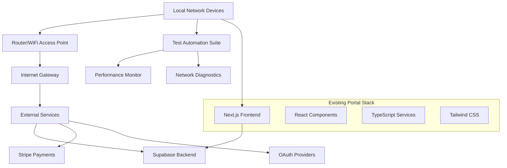

# Design Document

## Overview

The Studio Portal Local Network Testing system validates the existing HobbyistSwiftUI web partner portal functionality when accessed from devices connected to a local network. This testing framework ensures that all current portal features work correctly for studio users accessing the system from their typical internet-connected environment, providing comprehensive validation of the existing Next.js application with Supabase backend integration.

## Architecture

### Testing Environment Architecture



### Current Portal Architecture (Testing Target)

The existing web partner portal uses:
- **Frontend**: Next.js 14 with React 18 and TypeScript
- **Backend**: Supabase with optimized RLS policies
- **Authentication**: Supabase Auth with OAuth support
- **Payments**: Stripe integration
- **UI Framework**: Tailwind CSS with Headless UI
- **Performance**: Optimized with 50-70% query improvements

## Components and Interfaces

### 1. Test Orchestration Engine

**Purpose**: Coordinate all testing activities across local network devices

**Key Components**:
- **Test Runner**: Executes test suites across multiple devices
- **Result Aggregator**: Collects and analyzes test results
- **Report Generator**: Creates comprehensive testing reports
- **Device Manager**: Handles device registration and coordination

**Interfaces**:
```typescript
interface TestOrchestrator {
  registerDevice(device: TestDevice): void
  executeTestSuite(suite: TestSuite): Promise<TestResults>
  generateReport(results: TestResults[]): TestReport
  validateEnvironment(): EnvironmentStatus
}

interface TestDevice {
  id: string
  type: 'mobile' | 'tablet' | 'desktop'
  browser: string
  networkInfo: NetworkInfo
}
```

### 2. Portal Feature Validator

**Purpose**: Validate all existing portal features work correctly from local network

**Feature Coverage**:
- **Authentication**: OAuth flows, session management, credential validation
- **Onboarding**: Multi-step wizard, form validation, data persistence
- **Dashboard**: Real-time analytics, KPI widgets, data visualization
- **Class Management**: CRUD operations, scheduling, instructor assignment
- **Staff Management**: Invitations, role assignment, permission validation
- **Booking Management**: Reservations, payments, cancellations, communication
- **Settings**: Configuration management, subscription handling

**Validation Interface**:
```typescript
interface FeatureValidator {
  validateAuthentication(): Promise<AuthTestResult>
  validateOnboarding(): Promise<OnboardingTestResult>
  validateDashboard(): Promise<DashboardTestResult>
  validateClassManagement(): Promise<ClassTestResult>
  validateStaffManagement(): Promise<StaffTestResult>
  validateBookingSystem(): Promise<BookingTestResult>
  validateSettings(): Promise<SettingsTestResult>
}
```

### 3. Performance Monitor

**Purpose**: Monitor portal performance characteristics from local network devices

**Monitoring Scope**:
- **Page Load Times**: Initial load, navigation, asset loading
- **API Response Times**: Supabase queries, real-time updates
- **Network Requests**: Request/response patterns, data transfer
- **User Interface**: Rendering performance, interaction responsiveness
- **Database Operations**: Query execution, data synchronization

**Performance Interface**:
```typescript
interface PerformanceMonitor {
  measurePageLoad(page: string): Promise<LoadMetrics>
  measureApiResponse(endpoint: string): Promise<ApiMetrics>
  measureNetworkUsage(): Promise<NetworkMetrics>
  measureUIResponsiveness(): Promise<UIMetrics>
  compareWithBaseline(metrics: Metrics): PerformanceComparison
}
```

### 4. Network Diagnostics Suite

**Purpose**: Provide network-level debugging and diagnostic capabilities

**Diagnostic Features**:
- **Connectivity Testing**: Internet access, DNS resolution, port accessibility
- **Latency Measurement**: Round-trip times, packet loss analysis
- **Bandwidth Assessment**: Available bandwidth, network congestion
- **Security Validation**: HTTPS compliance, certificate validation
- **Browser Compatibility**: Feature support, polyfill requirements

**Diagnostics Interface**:
```typescript
interface NetworkDiagnostics {
  testConnectivity(): Promise<ConnectivityStatus>
  measureLatency(): Promise<LatencyMetrics>
  assessBandwidth(): Promise<BandwidthMetrics>
  validateSecurity(): Promise<SecurityStatus>
  checkBrowserSupport(): Promise<CompatibilityReport>
}
```

## Data Models

### Test Result Data Models

```typescript
interface TestResults {
  deviceId: string
  timestamp: Date
  testSuite: string
  results: FeatureTestResult[]
  performance: PerformanceMetrics
  networkInfo: NetworkInfo
  errors: TestError[]
}

interface FeatureTestResult {
  feature: string
  status: 'pass' | 'fail' | 'warning'
  duration: number
  details: TestDetails
  screenshots?: string[]
}

interface PerformanceMetrics {
  pageLoadTime: number
  apiResponseTime: number
  networkLatency: number
  uiResponsiveness: number
  resourceLoadTime: number
}

interface NetworkInfo {
  ipAddress: string
  connectionType: string
  bandwidth: number
  latency: number
  userAgent: string
}
```

### Portal Integration Models

```typescript
interface PortalConfiguration {
  supabaseUrl: string
  supabaseKey: string
  stripePublicKey: string
  enabledFeatures: string[]
  testDataSets: TestDataSet[]
}

interface TestDataSet {
  name: string
  users: TestUser[]
  studios: TestStudio[]
  classes: TestClass[]
  bookings: TestBooking[]
}
```

## Error Handling

### Test Execution Error Handling

**Error Categories**:
1. **Network Connectivity Errors**: Internet access, DNS resolution failures
2. **Authentication Errors**: OAuth failures, session timeout, credential issues
3. **Feature Function Errors**: Portal functionality failures, validation errors
4. **Performance Degradation**: Timeout errors, slow response times
5. **Browser Compatibility Errors**: Unsupported features, rendering issues

**Error Handling Strategy**:
```typescript
interface ErrorHandler {
  categorizeError(error: Error): ErrorCategory
  retryWithBackoff(operation: () => Promise<any>): Promise<any>
  logError(error: TestError): void
  generateErrorReport(errors: TestError[]): ErrorReport
  suggestFixActions(error: TestError): FixAction[]
}

interface TestError {
  type: ErrorCategory
  message: string
  timestamp: Date
  deviceId: string
  feature: string
  stackTrace?: string
  context: ErrorContext
}
```

### Graceful Degradation

**Fallback Mechanisms**:
- **Network Issues**: Offline mode detection, cached data usage
- **Feature Failures**: Alternative workflows, error state displays
- **Performance Problems**: Progressive loading, resource optimization
- **Browser Limitations**: Polyfill injection, feature detection

## Testing Strategy

### Automated Test Suite Architecture

**Test Organization**:
1. **Smoke Tests**: Basic functionality verification across all features
2. **Integration Tests**: End-to-end workflow validation
3. **Performance Tests**: Load time and responsiveness benchmarks
4. **Compatibility Tests**: Browser and device support validation
5. **Regression Tests**: Previously working functionality verification

**Test Execution Flow**:
```typescript
interface TestExecutionPlan {
  phases: TestPhase[]
  devices: TestDevice[]
  schedule: TestSchedule
  reporting: ReportingConfig
}

interface TestPhase {
  name: string
  tests: TestCase[]
  prerequisites: string[]
  timeout: number
  retryPolicy: RetryPolicy
}
```

### Cross-Device Testing Strategy

**Device Coverage**:
- **Mobile Devices**: iOS Safari, Android Chrome, various screen sizes
- **Tablets**: iPad Safari, Android Chrome, landscape/portrait modes
- **Desktop Browsers**: Chrome, Firefox, Safari, Edge on macOS/Windows
- **Network Conditions**: WiFi, ethernet, different bandwidth scenarios

**Test Scenarios**:
- **Single User Sessions**: Individual device testing, feature validation
- **Concurrent Sessions**: Multiple devices, simultaneous usage patterns
- **Session Handoff**: Device switching, session persistence
- **Performance Under Load**: Multiple users, resource contention

### Real-World Usage Simulation

**Studio Workflow Testing**:
- **Morning Setup**: Staff login, class preparation, system checks
- **Peak Usage**: Student check-ins, payment processing, real-time updates
- **Administrative Tasks**: Reporting, staff management, configuration changes
- **Evening Wrap-up**: Data synchronization, backup operations

## Performance Optimization Validation

### Existing Optimization Verification

**Supabase Performance**:
- **RLS Policy Optimization**: Validate 50-70% improvement in query performance
- **Initplan Pattern**: Verify auth.uid() optimization implementation
- **Connection Pooling**: Test database connection efficiency
- **Real-time Features**: Validate WebSocket performance

**Frontend Performance**:
- **Component Optimization**: Lazy loading, code splitting validation
- **Asset Optimization**: Image compression, CSS/JS minification
- **Caching Strategy**: Browser cache, CDN performance
- **Network Efficiency**: Request batching, data transfer optimization

### Performance Benchmarking

**Baseline Metrics**:
- **Page Load Time**: < 3 seconds initial load
- **API Response Time**: < 500ms for standard queries
- **UI Responsiveness**: < 100ms interaction feedback
- **Real-time Updates**: < 2 seconds data synchronization

**Monitoring Implementation**:
```typescript
interface PerformanceBenchmark {
  metric: string
  baseline: number
  threshold: number
  current: number
  trend: 'improving' | 'degrading' | 'stable'
}
```

## Security and Privacy Validation

### Security Testing Scope

**Authentication Security**:
- **OAuth Flow Validation**: Google Sign-In, credential security
- **Session Management**: Token handling, session timeout
- **Authorization Testing**: Role-based access, permission validation
- **HTTPS Enforcement**: SSL certificate validation, secure connections

**Data Protection Testing**:
- **PCI Compliance**: Payment data handling, Stripe integration security
- **GDPR Compliance**: Data privacy controls, user consent management
- **Input Validation**: XSS prevention, SQL injection protection
- **Audit Logging**: Activity tracking, compliance reporting

### Privacy Control Validation

**Data Handling Tests**:
- **Personal Data**: Student information, payment data protection
- **Business Data**: Studio information, financial data security
- **Communication**: Message encryption, notification security
- **Analytics**: Data anonymization, privacy-compliant tracking

## Documentation and Reporting

### Test Documentation

**Documentation Structure**:
- **Test Plan**: Comprehensive testing strategy and scope
- **Test Cases**: Detailed test scenarios with expected outcomes
- **User Guides**: Portal usage documentation for studio staff
- **Troubleshooting**: Common issues and resolution procedures

**Reporting Framework**:
```typescript
interface TestReport {
  summary: TestSummary
  detailedResults: TestResults[]
  performanceAnalysis: PerformanceReport
  recommendations: Recommendation[]
  nextSteps: ActionItem[]
}

interface TestSummary {
  totalTests: number
  passedTests: number
  failedTests: number
  warningTests: number
  executionTime: number
  coverage: CoverageReport
}
```

### Continuous Documentation

**Living Documentation**:
- **Automated Updates**: Test results integration with documentation
- **Version Control**: Change tracking, historical comparisons
- **Stakeholder Reports**: Executive summaries, technical details
- **Knowledge Base**: Common issues, solutions, best practices