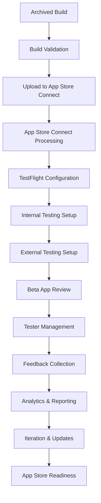

# Design Document

## Overview

This design document outlines the comprehensive approach for completing the TestFlight submission process for the HobbyistSwiftUI iOS application. The solution encompasses both manual processes through Xcode/App Store Connect and automated approaches using Fastlane, providing a robust deployment pipeline from the current archived state to successful TestFlight distribution.

Based on the current project state, the app has been successfully archived and is ready for the upload and configuration phases of TestFlight submission. The design leverages existing project infrastructure including configured bundle IDs, certificates, and comprehensive documentation already created for the project.

## Architecture

### High-Level Workflow Architecture



### Component Architecture

The TestFlight submission system is composed of several interconnected components:

1. **Build Management Layer**
   - Archive validation and upload
   - Version and build number management
   - Code signing verification

2. **App Store Connect Integration Layer**
   - Metadata configuration
   - Build processing status monitoring
   - App information management

3. **TestFlight Configuration Layer**
   - Testing group management
   - Build distribution settings
   - Beta review submission

4. **Automation Layer (Fastlane)**
   - Automated build processes
   - Continuous deployment pipelines
   - Error handling and notifications

5. **Testing Management Layer**
   - Tester invitation and management
   - Feedback collection and analysis
   - Crash reporting integration

6. **Analytics and Monitoring Layer**
   - Testing metrics tracking
   - Performance monitoring
   - Quality assurance reporting

## Components and Interfaces

### 1. Build Upload System

**Purpose**: Handle the upload process from archived build to App Store Connect

**Key Components**:
- **Archive Validator**: Pre-upload validation using Xcode's validation tools
- **Upload Manager**: Handles the actual upload process with retry logic
- **Status Monitor**: Tracks upload progress and processing status

**Interfaces**:
```bash
# Manual Interface (Xcode Organizer)
Product → Archive → Validate App → Distribute App

# Automated Interface (Fastlane)
fastlane upload_to_testflight
```

**Configuration Requirements**:
- Bundle ID: `com.hobbyist.app`
- Distribution Certificate: iOS Distribution
- Provisioning Profile: App Store Distribution
- Upload Options: Include symbols, exclude bitcode

### 2. App Store Connect Configuration System

**Purpose**: Configure app metadata and settings required for TestFlight

**Key Components**:
- **App Information Manager**: Basic app details and metadata
- **Version Manager**: Version and build number coordination
- **Compliance Manager**: Export compliance and content rating

**Configuration Data Structure**:
```json
{
  "app_info": {
    "bundle_id": "com.hobbyist.app",
    "name": "Hobbyist",
    "primary_language": "en-US",
    "sku": "hobbyist-ios-app-001"
  },
  "version_info": {
    "version": "1.0.0",
    "build": "1",
    "release_notes": "Initial beta release"
  },
  "compliance": {
    "export_compliance": false,
    "content_rights": true,
    "advertising_identifier": false
  }
}
```

### 3. TestFlight Testing Framework

**Purpose**: Manage internal and external testing groups and distribution

**Key Components**:
- **Internal Testing Manager**: Team member access and automatic distribution
- **External Testing Manager**: Public beta testing with review process
- **Group Manager**: Testing group creation and management
- **Invitation System**: Tester invitation and onboarding

**Testing Group Structure**:
```javascript
{
  internal_testing: {
    max_testers: 100,
    automatic_distribution: true,
    review_required: false,
    members: ["team@hobbyist.app", "dev@hobbyist.app"]
  },
  external_testing: {
    groups: [
      {
        name: "Design & UX Testers",
        max_testers: 20,
        focus: "UI/UX feedback"
      },
      {
        name: "Target Users",
        max_testers: 50,
        focus: "Real-world usage scenarios"
      },
      {
        name: "General Public",
        max_testers: 100,
        focus: "Broad compatibility testing"
      }
    ],
    review_required: true
  }
}
```

### 4. Beta Review Submission System

**Purpose**: Handle the beta review process for external testing

**Key Components**:
- **Review Information Manager**: Demo accounts and testing instructions
- **Submission Handler**: Beta review submission workflow
- **Status Tracker**: Review status monitoring and notifications

**Review Submission Payload**:
```markdown
# Beta App Review Information Template
- Demo Account: demo@hobbyist.app / BetaTest2024!
- App Description: Creative class booking platform for Vancouver
- Test Instructions: Complete booking flow with test payments
- Special Notes: Stripe test mode, no real financial transactions
```

### 5. Feedback and Analytics System

**Purpose**: Collect, analyze, and act on beta testing feedback

**Key Components**:
- **Feedback Collector**: TestFlight feedback aggregation
- **Crash Reporter**: Crash log analysis and reporting
- **Analytics Engine**: Usage metrics and performance monitoring
- **Report Generator**: Automated testing reports and insights

**Analytics Data Model**:
```typescript
interface TestingMetrics {
  engagement: {
    daily_active_testers: number;
    session_duration: number;
    feature_adoption_rates: Record<string, number>;
    retention_rates: {
      d1: number;
      d7: number;
      d30: number;
    };
  };
  quality: {
    crash_rate: number;
    app_rating: number;
    bug_report_count: number;
    performance_metrics: {
      load_times: number[];
      memory_usage: number[];
    };
  };
  feedback: {
    total_reports: number;
    actionable_reports: number;
    feature_requests: number;
    bug_reports: number;
  };
}
```

### 6. Automation Pipeline (Fastlane Integration)

**Purpose**: Automate the TestFlight submission and management process

**Key Components**:
- **Build Automation**: Automated archiving and uploading
- **Configuration Automation**: Automated metadata updates
- **Notification System**: Slack/email notifications for status updates
- **Error Handling**: Retry logic and error recovery

**Fastlane Configuration**:
```ruby
# Fastlane configuration for TestFlight automation
lane :testflight do
  # Ensure proper code signing
  setup_ci if ENV['CI']

  # Build the app
  build_app(
    scheme: "HobbyistSwiftUI",
    configuration: "Release",
    export_method: "app-store",
    export_options: {
      provisioningProfiles: {
        "com.hobbyist.app" => "Hobbyist App Store"
      }
    }
  )

  # Upload to TestFlight
  upload_to_testflight(
    skip_waiting_for_build_processing: false,
    notify_external_testers: false,
    groups: ["Internal Testing"]
  )

  # Send notification
  slack(
    message: "New build successfully uploaded to TestFlight!",
    channel: "#dev-notifications"
  )
end
```

## Data Models

### Build Information Model

```typescript
interface BuildInfo {
  id: string;
  version: string;
  build_number: string;
  upload_date: Date;
  processing_status: 'uploading' | 'processing' | 'ready' | 'invalid';
  size_bytes: number;
  min_os_version: string;
  supported_devices: string[];
  includes_symbols: boolean;
  beta_review_status?: 'not_submitted' | 'in_review' | 'approved' | 'rejected';
}
```

### Testing Group Model

```typescript
interface TestingGroup {
  id: string;
  name: string;
  type: 'internal' | 'external';
  max_testers: number;
  current_testers: number;
  builds: BuildInfo[];
  created_date: Date;
  description?: string;
  public_link?: string;
}
```

### Tester Model

```typescript
interface Tester {
  id: string;
  email: string;
  first_name?: string;
  last_name?: string;
  groups: string[];
  invitation_status: 'pending' | 'accepted' | 'expired';
  devices: Device[];
  testing_metrics: {
    sessions: number;
    feedback_reports: number;
    last_session: Date;
  };
}
```

### Feedback Model

```typescript
interface FeedbackReport {
  id: string;
  tester_id: string;
  build_id: string;
  type: 'crash' | 'feedback' | 'screenshot';
  timestamp: Date;
  content: string;
  screenshot_url?: string;
  device_info: {
    model: string;
    os_version: string;
    app_version: string;
  };
  status: 'new' | 'reviewing' | 'resolved' | 'closed';
  priority: 'low' | 'medium' | 'high' | 'critical';
}
```

## Error Handling

### Upload Error Management

**Common Upload Errors and Resolution**:

1. **Code Signing Issues**
   - Error: "Invalid Signature"
   - Resolution: Verify distribution certificate and provisioning profile
   - Automation: Automated certificate validation before upload

2. **Bundle ID Mismatch**
   - Error: "Bundle identifier doesn't match"
   - Resolution: Ensure Xcode project bundle ID matches App Store Connect
   - Prevention: Automated verification script

3. **Build Number Conflicts**
   - Error: "A build with this number already exists"
   - Resolution: Increment build number automatically
   - Automation: Fastlane auto-increment functionality

4. **Upload Timeout**
   - Error: "Upload timed out"
   - Resolution: Retry mechanism with exponential backoff
   - Monitoring: Upload progress tracking and alerts

### Processing Error Handling

```typescript
interface ErrorHandler {
  handleUploadError(error: UploadError): Promise<RetryStrategy>;
  handleProcessingError(buildId: string, error: ProcessingError): Promise<void>;
  handleReviewRejection(rejection: ReviewRejection): Promise<ResubmissionPlan>;
}

class TestFlightErrorHandler implements ErrorHandler {
  async handleUploadError(error: UploadError): Promise<RetryStrategy> {
    switch (error.type) {
      case 'network_timeout':
        return { retry: true, delay: 60000, max_attempts: 3 };
      case 'invalid_signature':
        return { retry: false, action: 'fix_certificates' };
      case 'bundle_id_mismatch':
        return { retry: false, action: 'update_bundle_id' };
      default:
        return { retry: true, delay: 30000, max_attempts: 1 };
    }
  }
}
```

### Beta Review Error Handling

**Review Rejection Scenarios**:

1. **Incomplete Information**
   - Issue: Missing demo account or test instructions
   - Resolution: Complete beta review information
   - Prevention: Automated validation checklist

2. **App Crashes During Review**
   - Issue: Critical bugs in submitted build
   - Resolution: Fix bugs and submit new build
   - Monitoring: Pre-submission crash testing

3. **Policy Violations**
   - Issue: App violates App Store guidelines
   - Resolution: Address specific guideline violations
   - Prevention: Pre-submission guideline compliance check

## Testing Strategy

### Automated Testing Pipeline

**Pre-Upload Testing**:
```bash
# Automated testing before TestFlight upload
./scripts/pre-testflight-validation.sh
```

**Test Automation Framework**:
1. **Unit Tests**: Core functionality validation
2. **Integration Tests**: Payment processing and API integration
3. **UI Tests**: Critical user flows automation
4. **Performance Tests**: Load time and memory usage validation
5. **Compatibility Tests**: iOS version and device compatibility

### Manual Testing Protocols

**Internal Testing Phase (Week 1-2)**:
- Team member testing on multiple devices
- Core functionality validation
- Payment flow testing with Stripe test mode
- Push notification testing
- Performance benchmarking

**External Testing Phase (Week 3-6)**:
- Gradual rollout to testing groups
- A/B testing for critical features
- Real-world usage scenario testing
- Accessibility testing
- Edge case and error handling testing

### Testing Success Metrics

**Quality Gates**:
```javascript
const qualityGates = {
  crash_rate: { threshold: 1.0, unit: 'percentage' },
  app_rating: { threshold: 4.0, unit: 'stars' },
  core_flow_success: { threshold: 95.0, unit: 'percentage' },
  load_time: { threshold: 3.0, unit: 'seconds' },
  memory_usage: { threshold: 150.0, unit: 'MB' }
};
```

**Testing Phases and Criteria**:
- **Alpha Phase**: Internal testing with crash rate < 2%
- **Beta Phase**: External testing with rating ≥ 3.5/5
- **Release Candidate**: All quality gates passed
- **App Store Ready**: Final validation and submission preparation

### Continuous Monitoring

**Real-time Monitoring**:
- Crash rate monitoring with immediate alerts
- User engagement tracking
- Performance metrics collection
- Feedback sentiment analysis

**Automated Reporting**:
- Daily testing summary reports
- Weekly comprehensive analytics
- Build comparison reports
- Quality trend analysis

This comprehensive design provides a robust framework for successfully completing the TestFlight submission process, ensuring both manual and automated approaches are covered with proper error handling, monitoring, and quality assurance measures.