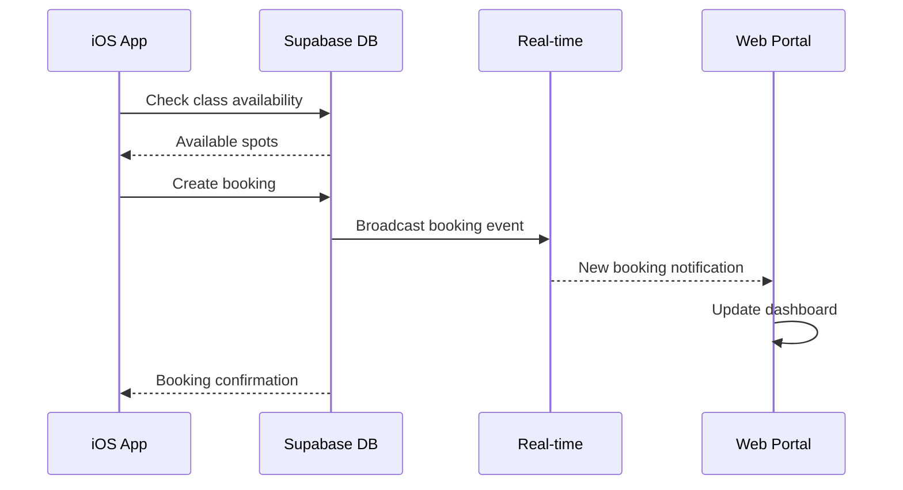
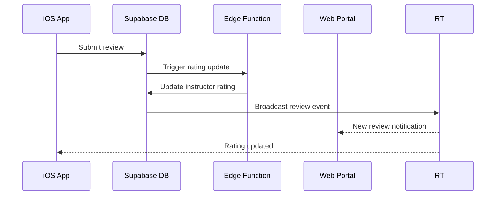

# 📚 Hobbyist Platform Integration Guide

## Table of Contents
1. [System Architecture](#system-architecture)
2. [Data Flow](#data-flow)
3. [API Endpoints](#api-endpoints)
4. [Real-time Events](#real-time-events)
5. [Authentication](#authentication)
6. [Testing Procedures](#testing-procedures)
7. [Deployment](#deployment)
8. [Troubleshooting](#troubleshooting)

## System Architecture

```
┌─────────────────────────────────────────────────────────────────────┐
│                         Supabase Backend                              │
│                   (mcjqvdzdhtcvbrejvrtp.supabase.co)                 │
│                                                                       │
│  ┌──────────────┐  ┌──────────────┐  ┌──────────────┐              │
│  │  PostgreSQL  │  │  Auth        │  │  Storage     │              │
│  │  Database    │  │  Service     │  │  Buckets     │              │
│  └──────────────┘  └──────────────┘  └──────────────┘              │
│         ▲                  ▲                  ▲                      │
│         │                  │                  │                      │
│  ┌──────────────────────────────────────────────┐                  │
│  │            Real-time Subscriptions            │                  │
│  └──────────────────────────────────────────────┘                  │
│         ▲                  ▲                  ▲                      │
└─────────┼──────────────────┼──────────────────┼─────────────────────┘
          │                  │                  │
    ┌─────▼──────┐    ┌──────▼──────┐   ┌──────▼──────┐
    │  iOS App   │    │ Web Portal  │   │   Edge      │
    │ (Students) │    │  (Studios)  │   │  Functions  │
    └────────────┘    └─────────────┘   └─────────────┘
```

## Data Flow

### 1. Class Booking Flow


### 2. Review Submission Flow


## API Endpoints

### Base URL
```
https://mcjqvdzdhtcvbrejvrtp.supabase.co
```

### Authentication Headers
```typescript
{
  'apikey': process.env.SUPABASE_ANON_KEY,
  'Authorization': `Bearer ${session.access_token}`,
  'Content-Type': 'application/json'
}
```

### Core Endpoints

#### Classes
```typescript
// Fetch classes with filters
GET /rest/v1/classes?select=*,instructor_profiles(*),studio_locations(*),categories(*)
    &category_id=eq.{categoryId}
    &location_id=eq.{locationId}
    &is_active=eq.true
    &order=start_time.asc

// Create class (Studios only)
POST /rest/v1/classes
Body: {
  name: string,
  description: string,
  instructor_id: UUID,
  location_id: UUID,
  category_id: UUID,
  price: number,
  capacity: number,
  start_time: ISO8601,
  duration_minutes: number
}

// Update class
PATCH /rest/v1/classes?id=eq.{classId}
Body: { ...updates }
```

#### Bookings
```typescript
// Create booking
POST /rest/v1/bookings
Body: {
  class_id: UUID,
  user_id: UUID,
  status: 'confirmed',
  payment_method: 'credit' | 'cash' | 'subscription'
}

// Get user bookings
GET /rest/v1/bookings?user_id=eq.{userId}&select=*,classes(*,instructor_profiles(*))

// Cancel booking
PATCH /rest/v1/bookings?id=eq.{bookingId}
Body: { status: 'cancelled', cancelled_at: ISO8601 }
```

#### Instructors
```typescript
// Fetch instructor profiles
GET /rest/v1/instructor_profiles?select=*&is_active=eq.true&order=average_rating.desc

// Get instructor with reviews
GET /rest/v1/instructor_profiles?id=eq.{instructorId}&select=*,instructor_reviews(*)

// Follow instructor
POST /rest/v1/instructor_followers
Body: {
  instructor_id: UUID,
  follower_id: UUID,
  notify_new_classes: boolean
}
```

#### Reviews
```typescript
// Submit review
POST /rest/v1/instructor_reviews
Body: {
  instructor_id: UUID,
  student_id: UUID,
  booking_id: UUID,
  rating: 1-5,
  title: string,
  comment: string
}

// Get reviews for instructor
GET /rest/v1/instructor_reviews?instructor_id=eq.{instructorId}&is_visible=eq.true
```

#### Locations
```typescript
// Get all studio locations
GET /rest/v1/studio_locations?is_active=eq.true&select=*

// Get classes for location
GET /rest/v1/classes?location_id=eq.{locationId}&select=*
```

## Real-time Events

### Subscription Setup

#### iOS (Swift)
```swift
// Subscribe to class updates
let subscription = supabase
    .from("classes")
    .on(.all) { event in
        switch event.type {
        case .insert:
            handleNewClass(event.new)
        case .update:
            handleClassUpdate(event.new)
        case .delete:
            handleClassDeletion(event.old)
        }
    }
    .subscribe()

// Subscribe to user's bookings
let bookingSubscription = supabase
    .from("bookings")
    .on(.all)
    .filter("user_id", .eq, userId)
    .subscribe { event in
        updateUserBookings(event)
    }
```

#### Web (TypeScript)
```typescript
// Subscribe to studio's bookings
const subscription = supabase
  .from('bookings')
  .on('INSERT', payload => {
    console.log('New booking:', payload.new);
    updateDashboard(payload.new);
  })
  .filter('studio_id', 'eq', studioId)
  .subscribe();

// Subscribe to reviews
const reviewSub = supabase
  .from('instructor_reviews')
  .on('*', payload => {
    handleReviewUpdate(payload);
  })
  .subscribe();
```

### Event Types
| Event | Table | Trigger | Payload |
|-------|-------|---------|---------|
| `booking.created` | bookings | New booking | Full booking object |
| `class.updated` | classes | Class modified | Updated class data |
| `review.submitted` | instructor_reviews | New review | Review with user info |
| `instructor.followed` | instructor_followers | Follow action | Follower relationship |
| `location.updated` | studio_locations | Location change | Location details |

## Authentication

### User Roles
```typescript
enum UserRole {
  STUDENT = 'student',        // Can book classes, write reviews
  INSTRUCTOR = 'instructor',  // Can view their classes, respond to reviews
  STUDIO_OWNER = 'owner',     // Full studio management
  STUDIO_ADMIN = 'admin',     // Limited studio management
  SUPER_ADMIN = 'super'       // Platform administration
}
```

### Auth Flow

#### iOS Sign Up
```swift
func signUp(email: String, password: String) async throws -> User {
    let response = try await supabase.auth.signUp(
        email: email,
        password: password,
        data: [
            "role": "student",
            "platform": "ios"
        ]
    )
    
    // Create user profile
    try await supabase
        .from("user_profiles")
        .insert([
            "id": response.user.id,
            "email": email,
            "created_from": "ios_app"
        ])
        .execute()
    
    return response.user
}
```

#### Web Portal Sign In
```typescript
async function signInStudio(email: string, password: string) {
  const { data, error } = await supabase.auth.signInWithPassword({
    email,
    password
  });
  
  if (data?.user) {
    // Verify studio access
    const { data: studio } = await supabase
      .from('studios')
      .select('*')
      .eq('owner_id', data.user.id)
      .single();
      
    if (!studio) {
      throw new Error('Not authorized for studio access');
    }
    
    return { user: data.user, studio };
  }
}
```

### Session Management
```typescript
// Auto-refresh tokens
const supabase = createClient(url, key, {
  auth: {
    autoRefreshToken: true,
    persistSession: true,
    detectSessionInUrl: true
  }
});

// Check session validity
async function validateSession() {
  const { data: { session } } = await supabase.auth.getSession();
  
  if (!session) {
    // Redirect to login
    return false;
  }
  
  // Refresh if needed
  if (isExpiringSoon(session.expires_at)) {
    await supabase.auth.refreshSession();
  }
  
  return true;
}
```

## Testing Procedures

### 1. Unit Tests

#### iOS
```bash
# Run all tests
xcodebuild test -scheme HobbyistSwiftUI \
  -destination 'platform=iOS Simulator,name=iPhone 15 Pro'

# Run integration tests only
xcodebuild test -scheme HobbyistSwiftUI \
  -only-testing:HobbyistSwiftUITests/IntegrationTests
```

#### Web
```bash
# Run all tests
cd web-partner && npm test

# Run integration tests
npm run test:integration

# Run with coverage
npm run test:coverage
```

### 2. End-to-End Tests

```typescript
// Playwright test example
import { test, expect } from '@playwright/test';

test('complete booking flow', async ({ page }) => {
  // 1. Student signs in on iOS (simulated)
  const studentId = await createTestStudent();
  
  // 2. Studio creates class in web portal
  await page.goto('/dashboard/classes');
  await page.click('[data-testid="create-class"]');
  await page.fill('[name="name"]', 'Test Pottery Class');
  await page.click('[type="submit"]');
  
  // 3. Verify class appears in API
  const classes = await fetchClasses();
  expect(classes).toContainEqual(
    expect.objectContaining({ name: 'Test Pottery Class' })
  );
  
  // 4. Book class via API (simulating iOS)
  const booking = await createBooking(classes[0].id, studentId);
  expect(booking.status).toBe('confirmed');
  
  // 5. Verify booking appears in dashboard
  await page.goto('/dashboard/reservations');
  await expect(page.locator(`[data-booking-id="${booking.id}"]`)).toBeVisible();
});
```

### 3. Load Testing

```javascript
// K6 load test script
import http from 'k6/http';
import { check } from 'k6';

export let options = {
  stages: [
    { duration: '2m', target: 100 },  // Ramp up
    { duration: '5m', target: 100 },  // Stay at 100 users
    { duration: '2m', target: 0 },    // Ramp down
  ],
};

export default function() {
  // Test class listing endpoint
  let response = http.get('https://mcjqvdzdhtcvbrejvrtp.supabase.co/rest/v1/classes');
  check(response, {
    'status is 200': (r) => r.status === 200,
    'response time < 500ms': (r) => r.timings.duration < 500,
  });
  
  // Test booking creation
  let booking = http.post(
    'https://mcjqvdzdhtcvbrejvrtp.supabase.co/rest/v1/bookings',
    JSON.stringify({
      class_id: 'test-class-id',
      user_id: 'test-user-id'
    }),
    { headers: { 'Content-Type': 'application/json' } }
  );
  check(booking, {
    'booking created': (r) => r.status === 201,
  });
}
```

## Deployment

### iOS App Deployment

```bash
# 1. Update version
agvtool new-version -all 1.0.1

# 2. Archive for TestFlight
xcodebuild archive \
  -scheme HobbyistSwiftUI \
  -configuration Release \
  -archivePath ./build/HobbyistSwiftUI.xcarchive

# 3. Export for App Store
xcodebuild -exportArchive \
  -archivePath ./build/HobbyistSwiftUI.xcarchive \
  -exportPath ./build \
  -exportOptionsPlist ExportOptions.plist

# 4. Upload to App Store Connect
xcrun altool --upload-app \
  -f ./build/HobbyistSwiftUI.ipa \
  -u $APPLE_ID \
  -p $APP_SPECIFIC_PASSWORD
```

### Web Portal Deployment

```bash
# 1. Build production bundle
cd web-partner
npm run build

# 2. Deploy to Vercel
vercel --prod

# Or deploy to custom server
scp -r .next/* user@server:/var/www/portal/
```

### Database Migrations

```bash
# 1. Test migrations locally
supabase db reset
supabase migration up

# 2. Apply to production
supabase db push --db-url $PRODUCTION_DB_URL

# 3. Verify migration
psql $PRODUCTION_DB_URL -f scripts/validate_integration.sql
```

## Troubleshooting

### Common Issues

#### Issue: Real-time updates not working
```typescript
// Debug real-time connection
const debug = supabase
  .from('classes')
  .on('*', (payload) => {
    console.log('Received:', payload);
  })
  .subscribe((status) => {
    console.log('Subscription status:', status);
  });

// Check WebSocket connection
if (supabase.realtime.isConnected()) {
  console.log('WebSocket connected');
} else {
  console.log('WebSocket disconnected');
  supabase.realtime.connect();
}
```

#### Issue: Authentication token expired
```swift
// iOS: Force token refresh
func refreshAuth() async throws {
    try await supabase.auth.refreshSession()
    
    // Get new token
    if let session = try await supabase.auth.session {
        print("New token expires at: \(session.expiresAt)")
    }
}
```

#### Issue: CORS errors in web portal
```typescript
// Add to next.config.js
module.exports = {
  async headers() {
    return [
      {
        source: '/api/:path*',
        headers: [
          { key: 'Access-Control-Allow-Origin', value: '*' },
          { key: 'Access-Control-Allow-Methods', value: 'GET,POST,PUT,DELETE,OPTIONS' },
          { key: 'Access-Control-Allow-Headers', value: 'Content-Type, Authorization' },
        ],
      },
    ];
  },
};
```

### Debug Logging

#### Enable verbose logging
```swift
// iOS
let client = SupabaseClient(
    supabaseURL: url,
    supabaseKey: key,
    options: SupabaseClientOptions(
        db: .init(encoder: .init(), decoder: .init()),
        auth: .init(debug: true),
        global: .init(logger: ConsoleLogger())
    )
)
```

```typescript
// Web
const supabase = createClient(url, key, {
  global: {
    debug: true
  }
});

// Log all database queries
supabase.on('query', (query) => {
  console.log('Query:', query);
});
```

### Health Checks

```bash
# Check database connection
curl https://mcjqvdzdhtcvbrejvrtp.supabase.co/rest/v1/ \
  -H "apikey: $SUPABASE_ANON_KEY"

# Check real-time service
curl https://mcjqvdzdhtcvbrejvrtp.supabase.co/realtime/v1/websocket \
  -H "apikey: $SUPABASE_ANON_KEY"

# Check storage
curl https://mcjqvdzdhtcvbrejvrtp.supabase.co/storage/v1/buckets \
  -H "apikey: $SUPABASE_ANON_KEY"
```

## Support

- **Documentation**: [https://github.com/Chromeox/HobbyistSwiftUI](https://github.com/Chromeox/HobbyistSwiftUI)
- **Issues**: [GitHub Issues](https://github.com/Chromeox/HobbyistSwiftUI/issues)
- **Supabase Status**: [status.supabase.com](https://status.supabase.com)

## Version History

| Version | Date | Changes |
|---------|------|---------|
| 1.0.0 | 2024-09-01 | Initial release |
| 1.1.0 | 2024-09-02 | Added instructor marketplace |
| 1.2.0 | 2024-09-02 | Multi-location support |
| 1.3.0 | 2024-09-02 | Review system integration |
| 1.4.0 | 2024-09-02 | Real-time subscriptions |