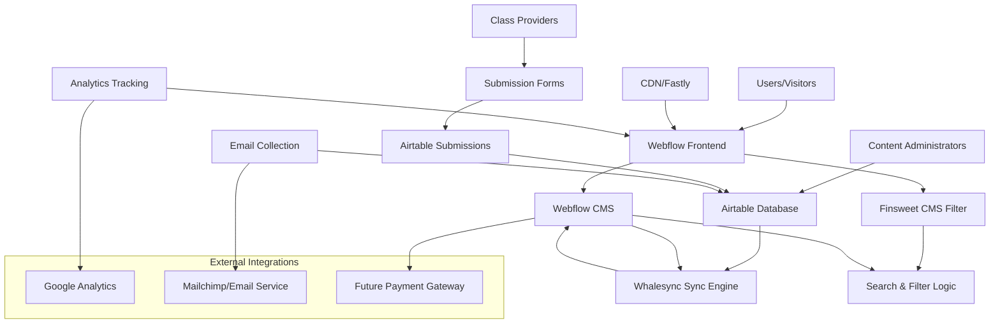
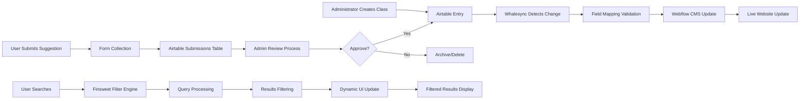
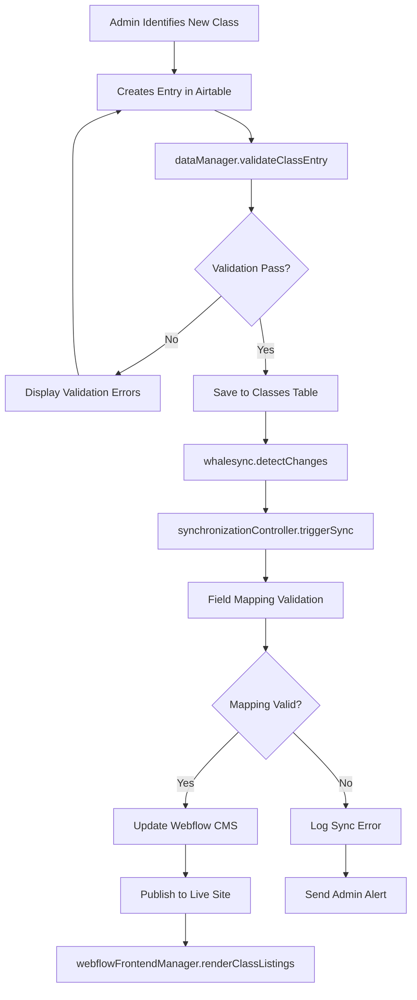
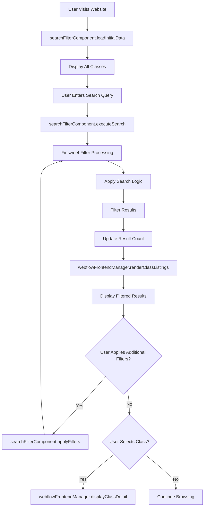
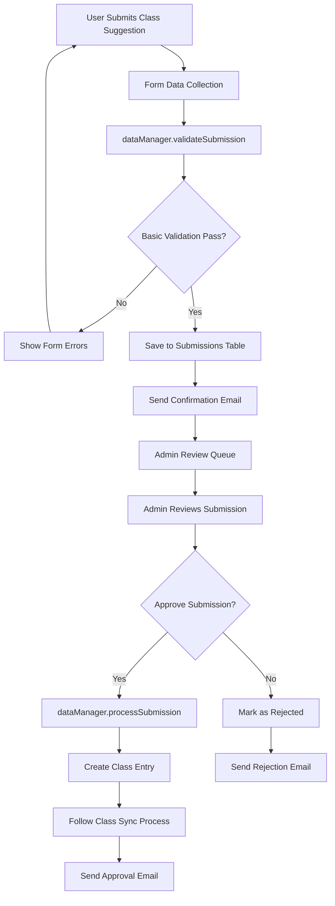
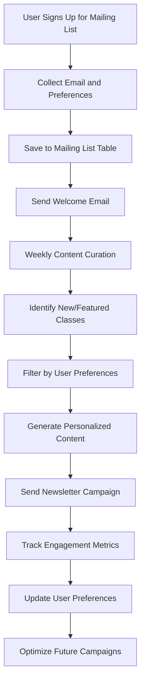

# Hobby Classes Directory - Design Document

## Overview

The Hobby Classes Directory is Vancouver's premier creative event discovery platform that connects hobby class seekers with local providers. The system leverages a no-code architecture using Webflow for the frontend, Airtable for data management, Whalesync for synchronization, and Finsweet components for enhanced functionality. The design prioritizes performance, scalability, and user experience while maintaining operational costs within the £80-£100 monthly budget.

**Design Goals:**
- Create a scalable, high-performance directory platform
- Enable seamless bidirectional data synchronization
- Provide advanced search and filtering capabilities  
- Support future monetization features
- Maintain optimal user experience across all devices

**Scope:**
- Frontend website architecture and user interface design
- Database schema and data modeling
- System integration and synchronization workflows
- Search and filtering system implementation
- Content management and quality control processes

## Architecture Design

### System Architecture Diagram



### Data Flow Diagram



## Component Design

### Frontend Components (Webflow)

#### WebflowFrontendManager
- **Responsibilities**: 
  - Serve dynamic content from CMS collections
  - Handle responsive design across devices
  - Manage user interactions and navigation
  - Integrate with Finsweet filter components
- **Interfaces**:
  - `renderClassListings(filters: FilterCriteria): Collection[]`
  - `displayClassDetail(classId: string): ClassDetail`
  - `handleUserSubmission(formData: FormData): SubmissionResult`
- **Dependencies**: 
  - Webflow CMS API
  - Finsweet Attributes
  - Relume component library

#### SearchFilterComponent
- **Responsibilities**:
  - Process user search queries
  - Apply multiple filter criteria
  - Manage filter state and UI updates
  - Provide search result counts
- **Interfaces**:
  - `executeSearch(query: string): SearchResult[]`
  - `applyFilters(criteria: FilterCriteria[]): FilterResult`
  - `clearAllFilters(): void`
- **Dependencies**:
  - Finsweet CMS Filter v2
  - Webflow Collection Lists

### Backend Components (Airtable)

#### DataManager
- **Responsibilities**:
  - Maintain class data integrity
  - Handle data validation and quality control
  - Manage relationships between entities
  - Process user submissions
- **Interfaces**:
  - `validateClassEntry(data: ClassData): ValidationResult`
  - `processSubmission(submission: UserSubmission): ProcessResult`
  - `maintainDataQuality(): QualityReport`
- **Dependencies**:
  - Airtable API
  - Data validation rules

#### SynchronizationController
- **Responsibilities**:
  - Monitor data changes
  - Trigger sync operations
  - Handle sync conflicts
  - Maintain sync logs
- **Interfaces**:
  - `detectChanges(): ChangeSet[]`
  - `triggerSync(changes: ChangeSet): SyncResult`
  - `resolveSyncConflict(conflict: ConflictData): Resolution`
- **Dependencies**:
  - Whalesync API
  - Change detection algorithms

## Data Model

### Core Data Structure Definitions

```typescript
// Primary Class Entity
interface ClassEntry {
  id: string;
  title: string;
  description: string;
  shortDescription?: string;
  instructor: InstructorReference;
  category: CategoryReference;
  location: LocationReference;
  pricing: PricingInfo;
  schedule: ScheduleInfo[];
  status: 'active' | 'inactive' | 'draft';
  contactInfo: ContactInfo;
  images?: ImageAsset[];
  tags: string[];
  createdAt: Date;
  updatedAt: Date;
  featured: boolean;
  seoSlug: string;
}

// Supporting Entity Structures
interface InstructorReference {
  id: string;
  name: string;
  bio?: string;
  profileImage?: ImageAsset;
  experience?: string;
  qualifications?: string[];
}

interface CategoryReference {
  id: string;
  name: string;
  slug: string;
  description?: string;
  parentCategory?: string;
  displayOrder: number;
}

interface LocationReference {
  id: string;
  venueName: string;
  address: AddressInfo;
  neighborhood: string;
  transitAccess?: string;
  amenities?: string[];
}

interface PricingInfo {
  currency: 'CAD';
  dropInPrice?: number;
  packagePrice?: number;
  packageSessions?: number;
  membershipPrice?: number;
  priceDisplay: string; // Formatted display text
  paymentOptions: string[];
}

interface ScheduleInfo {
  dayOfWeek: string;
  startTime: string;
  endTime: string;
  duration: number; // minutes
  frequency: 'weekly' | 'biweekly' | 'monthly' | 'one-time';
  startDate?: Date;
  endDate?: Date;
}

// User Interaction Data
interface UserSubmission {
  id: string;
  type: 'class_suggestion' | 'provider_inquiry' | 'feedback';
  submitterEmail?: string;
  submitterName?: string;
  classTitle?: string;
  providerName?: string;
  description: string;
  contactInfo?: string;
  status: 'pending' | 'approved' | 'rejected' | 'duplicate';
  submittedAt: Date;
  reviewedAt?: Date;
  reviewedBy?: string;
  notes?: string;
}

// Mailing List Management
interface MailingListEntry {
  id: string;
  email: string;
  name?: string;
  interests: CategoryReference[];
  subscribedAt: Date;
  status: 'active' | 'unsubscribed';
  source: 'website_signup' | 'class_inquiry' | 'manual_add';
  preferences: NotificationPreferences;
}

interface NotificationPreferences {
  frequency: 'weekly' | 'biweekly' | 'monthly';
  types: ('new_classes' | 'featured_events' | 'newsletter')[];
  locations: LocationReference[];
}
```

### Database Schema Design

#### Airtable Table Structures

**Classes Table**
- **Primary Key**: Class ID (Auto-generated)
- **Fields**:
  - Title (Single line text) - Required
  - Description (Long text) - Required
  - Short Description (Single line text)
  - Instructor (Link to Instructors table) - Required
  - Category (Link to Categories table) - Required
  - Location (Link to Locations table) - Required
  - Pricing Display (Single line text) - Required
  - Drop-in Price (Currency)
  - Package Price (Currency)
  - Package Sessions (Number)
  - Schedule JSON (Long text) - JSON formatted
  - Status (Single select: Active, Inactive, Draft) - Required
  - Contact Email (Email)
  - Contact Phone (Phone number)
  - Website URL (URL)
  - Images (Attachments - Multiple)
  - Tags (Multiple select)
  - Featured (Checkbox)
  - SEO Slug (Single line text) - Unique
  - Created At (Created time)
  - Updated At (Last modified time)

**Instructors Table**
- **Primary Key**: Instructor ID (Auto-generated)
- **Fields**:
  - Name (Single line text) - Required
  - Bio (Long text)
  - Profile Image (Attachment)
  - Experience (Single line text)
  - Qualifications (Multiple select)
  - Contact Email (Email)
  - Website (URL)
  - Classes (Link to Classes table) - Multiple

**Categories Table**
- **Primary Key**: Category ID (Auto-generated)
- **Fields**:
  - Name (Single line text) - Required
  - Slug (Single line text) - Unique, Required
  - Description (Long text)
  - Parent Category (Link to Categories table)
  - Display Order (Number) - Required
  - Icon (Attachment)
  - Classes Count (Count of linked Classes)
  - Active (Checkbox) - Default: True

**Locations Table**
- **Primary Key**: Location ID (Auto-generated)
- **Fields**:
  - Venue Name (Single line text) - Required
  - Address (Single line text) - Required
  - City (Single line text) - Default: "Vancouver"
  - Province (Single line text) - Default: "BC"
  - Postal Code (Single line text)
  - Neighborhood (Single line text) - Required
  - Transit Access (Long text)
  - Amenities (Multiple select)
  - Latitude (Number)
  - Longitude (Number)
  - Classes (Link to Classes table) - Multiple

#### Webflow CMS Collection Structures

**Classes Collection**
- **Item Structure**:
  - Name: Class Title (Plain text)
  - Slug: Auto-generated from title
  - Description: Rich text editor
  - Short Description: Plain text (160 chars max)
  - Instructor: Reference to Instructors Collection
  - Category: Reference to Categories Collection
  - Location: Reference to Locations Collection
  - Featured Image: Image field
  - Gallery: Multi-image field
  - Pricing Display: Plain text
  - Schedule Display: Rich text
  - Contact Info: Rich text
  - Tags: Multi-reference to Tags Collection
  - Status: Option field (Published/Draft)
  - Featured: Switch (true/false)
  - Meta Description: Plain text (SEO)

### Data Validation Rules and Constraints

#### Airtable Validation Rules
```javascript
// Class Entry Validation
const classValidationRules = {
  title: {
    required: true,
    maxLength: 100,
    pattern: /^[a-zA-Z0-9\s\-&'.,()]+$/
  },
  description: {
    required: true,
    minLength: 50,
    maxLength: 2000
  },
  instructor: {
    required: true,
    validReference: true
  },
  category: {
    required: true,
    validReference: true
  },
  location: {
    required: true,
    validReference: true
  },
  pricingDisplay: {
    required: true,
    pattern: /\$\d+/
  },
  contactEmail: {
    required: true,
    format: 'email'
  },
  seoSlug: {
    required: true,
    unique: true,
    pattern: /^[a-z0-9\-]+$/
  }
};

// Category Validation
const categoryValidationRules = {
  name: {
    required: true,
    maxLength: 50,
    unique: true
  },
  slug: {
    required: true,
    unique: true,
    pattern: /^[a-z0-9\-]+$/
  },
  displayOrder: {
    required: true,
    type: 'number',
    min: 1
  }
};
```

### Indexing Strategies for Performance

#### Airtable Performance Optimization
- **Primary Indexes**: All linked field relationships
- **Search Indexes**: Title, Description, Instructor Name, Category Name
- **Filter Indexes**: Status, Featured, Category, Location, Tags
- **Sort Indexes**: Created At, Updated At, Display Order

#### Webflow CMS Performance
- **Collection List Limits**: 100 items per page with List Load pagination
- **Reference Field Optimization**: Minimize nested reference lookups
- **Image Optimization**: Use Webflow's built-in image optimization
- **CDN Strategy**: Leverage Fastly CDN for static asset delivery

## Business Process

### Process 1: Class Data Entry and Synchronization



### Process 2: User Class Search and Discovery



### Process 3: User Submission and Quality Control



### Process 4: Mailing List Management and User Engagement



## Error Handling Strategy

### Synchronization Error Handling

#### Whalesync Sync Failures
```javascript
const syncErrorHandling = {
  connectionErrors: {
    retryPolicy: {
      maxRetries: 3,
      backoffStrategy: 'exponential',
      initialDelay: 5000
    },
    fallbackAction: 'queue_for_manual_review'
  },
  
  fieldMappingErrors: {
    validationFailure: {
      action: 'log_detailed_error',
      notification: 'email_admin',
      preserveData: true
    },
    dataTypeConflict: {
      action: 'attempt_type_conversion',
      fallback: 'skip_field_with_warning'
    }
  },
  
  rateLimitErrors: {
    detection: 'monitor_api_calls',
    response: 'queue_requests',
    backoffPeriod: '300_seconds'
  }
};
```

#### Data Quality Issues
```javascript
const dataQualityHandling = {
  duplicateDetection: {
    algorithm: 'fuzzy_matching',
    fields: ['title', 'instructor', 'location'],
    threshold: 0.85,
    action: 'flag_for_review'
  },
  
  incompleteData: {
    requiredFields: ['title', 'description', 'instructor', 'category', 'location'],
    partialSubmissions: 'save_as_draft',
    reminderSchedule: [24, 72, 168] // hours
  },
  
  dataIntegrityChecks: {
    schedule: 'daily_3am',
    checks: [
      'orphaned_references',
      'invalid_dates',
      'missing_required_fields',
      'broken_image_links'
    ],
    reportDelivery: 'email_admin_summary'
  }
};
```

### User-Facing Error Handling

#### Search and Filter Errors
- **No Results Found**: Display helpful suggestions and alternative searches
- **Filter Combination Issues**: Show available options and reset suggestions
- **Loading Timeouts**: Implement graceful degradation with cached results
- **JavaScript Errors**: Provide basic search functionality fallback

#### Form Submission Errors
- **Validation Errors**: Clear, field-specific error messages
- **Network Issues**: Queue submissions for retry with user notification
- **Duplicate Submissions**: Intelligent duplicate detection and user guidance
- **Image Upload Failures**: Alternative upload methods and compression

### Recovery Mechanisms

#### Automated Recovery
```javascript
const recoveryMechanisms = {
  syncMonitoring: {
    healthCheck: 'every_5_minutes',
    alertThreshold: '3_consecutive_failures',
    autoRecovery: 'restart_sync_process'
  },
  
  databaseBackup: {
    frequency: 'daily',
    retentionPeriod: '30_days',
    verificationSchedule: 'weekly',
    restoreTestProcedure: 'monthly'
  },
  
  cacheInvalidation: {
    triggerEvents: ['sync_completion', 'manual_update'],
    strategy: 'selective_invalidation',
    fallbackCache: '24_hour_retention'
  }
};
```

#### Manual Recovery Procedures
1. **Sync Failure Recovery**:
   - Identify failed sync operations in Whalesync dashboard
   - Verify data consistency between Airtable and Webflow
   - Manual sync trigger for specific records if needed
   - Data integrity verification post-recovery

2. **Data Corruption Recovery**:
   - Rollback to last known good state from backup
   - Incremental data recovery from audit logs
   - Field-level recovery for partial corruption
   - User notification of any data loss

3. **Performance Degradation Recovery**:
   - Database query optimization review
   - Index rebuild procedures
   - Cache warming strategies
   - CDN cache purging if necessary

## Testing Strategy

### Automated Testing Approach

#### Data Synchronization Testing
```javascript
const syncTestSuite = {
  unitTests: {
    fieldMapping: 'verify_all_field_transformations',
    dataValidation: 'test_validation_rules',
    errorHandling: 'simulate_sync_failures'
  },
  
  integrationTests: {
    endToEndSync: 'airtable_to_webflow_complete_flow',
    bidirectionalSync: 'verify_two_way_data_consistency',
    bulkOperations: 'test_large_dataset_sync'
  },
  
  performanceTests: {
    syncSpeed: 'measure_sync_completion_time',
    resourceUsage: 'monitor_api_call_limits',
    scalabilityThreshold: 'test_1000_record_sync'
  }
};
```

#### User Interface Testing
```javascript
const uiTestSuite = {
  functionalTests: {
    searchFunctionality: 'test_all_search_scenarios',
    filterOperations: 'verify_filter_combinations',
    responsiveDesign: 'test_mobile_tablet_desktop'
  },
  
  usabilityTests: {
    navigationFlow: 'measure_task_completion_time',
    accessibility: 'verify_wcag_compliance',
    loadPerformance: 'test_page_speed_metrics'
  },
  
  compatibilityTests: {
    browserSupport: 'test_chrome_firefox_safari_edge',
    deviceTesting: 'verify_ios_android_functionality',
    networkConditions: 'test_slow_connection_experience'
  }
};
```

### Manual Testing Procedures

#### Content Quality Assurance
1. **Data Entry Testing**:
   - Create test class entries with various data combinations
   - Verify all required fields are properly validated
   - Test edge cases (special characters, long text, etc.)
   - Confirm proper handling of optional fields

2. **Sync Verification Testing**:
   - Monitor sync time from Airtable update to website display
   - Verify data accuracy across platforms
   - Test sync behavior during high-traffic periods
   - Confirm proper error notification systems

#### User Experience Testing
1. **Search and Discovery Testing**:
   - Test search functionality with various query types
   - Verify filter combinations work correctly
   - Test search performance with large datasets
   - Validate mobile search experience

2. **Form Submission Testing**:
   - Test all user submission forms
   - Verify email confirmations and admin notifications
   - Test form validation and error handling
   - Confirm submission processing workflow

### Performance Testing Metrics

#### Key Performance Indicators
```javascript
const performanceMetrics = {
  pageLoadTime: {
    target: '3_seconds_max',
    measurement: 'lighthouse_audit',
    frequency: 'weekly'
  },
  
  searchResponseTime: {
    target: '1_second_max',
    measurement: 'filter_execution_time',
    frequency: 'daily'
  },
  
  syncPerformance: {
    target: '5_minutes_max_delay',
    measurement: 'whalesync_completion_time',
    frequency: 'continuous_monitoring'
  },
  
  databaseQueries: {
    target: '2_seconds_max',
    measurement: 'airtable_api_response',
    frequency: 'hourly'
  }
};
```

#### Load Testing Scenarios
1. **Concurrent User Testing**:
   - Simulate 100+ simultaneous users
   - Test search and filter performance under load
   - Verify database connection stability
   - Monitor resource usage and response times

2. **Data Volume Testing**:
   - Test with 5,000+ class entries
   - Verify search performance with large datasets
   - Test sync performance with bulk operations
   - Confirm pagination and loading strategies

This comprehensive design document provides the technical foundation for implementing the Hobby Classes Directory platform. The architecture ensures scalability, maintainability, and optimal user experience while staying within budget constraints and utilizing the specified no-code technology stack.